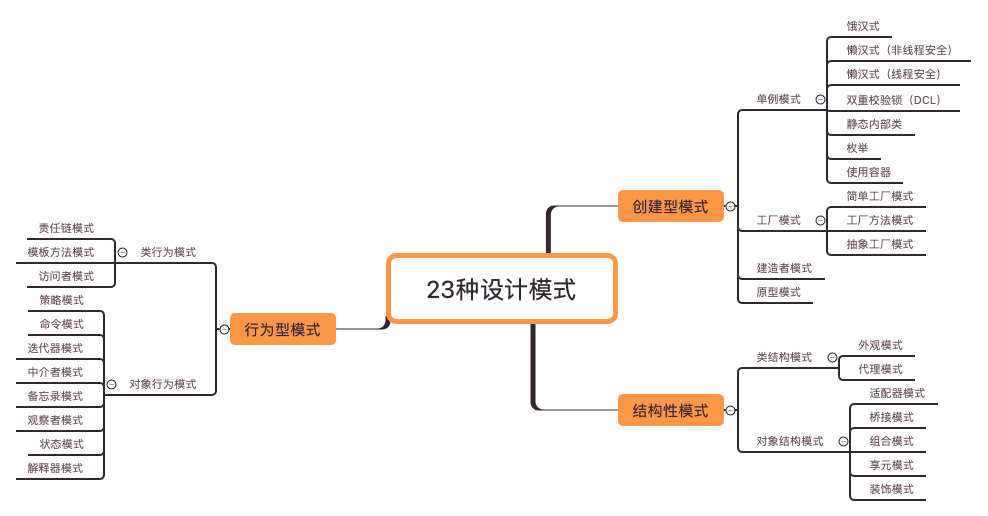

# design-pattern

本项目主要是博主针对设计模式学习进行的系统整理文档示例，方便学习查阅。[设计模式](<https://baike.baidu.com/item/%E8%AE%BE%E8%AE%A1%E6%A8%A1%E5%BC%8F/1212549?fr=aladdin>)是一套被反复使用、多数人知晓的、经过分类的、代码设计经验的总结。所以不管使用何种编程语言进行开发，系统的学习设计模式都是有好处的。

本项目纯属个人的学习经验总结，如果有不对的地方欢迎来提[Issues](<https://github.com/JordanHank/design-pattern/issues>)进行讨论。

## 创建模式

- [Singleton 单例模式](https://github.com/JordanHank/design-pattern/blob/master/docs/build/singleton.md)

- [Factory 工厂模式](https://github.com/JordanHank/design-pattern/blob/master/docs/build/factory.md)

- [Builder 建造者模式](https://github.com/JordanHank/design-pattern/blob/master/docs/build/builder.md)

- [Prototype 原型模式](https://github.com/JordanHank/design-pattern/blob/master/docs/build/prototype.md)

## 结构型模式

- 类结构型模式
    
    + [Facade 外观模式](https://github.com/JordanHank/design-pattern/blob/master/docs/build/facade.md)
    
    + [Proxy 代理模式](https://github.com/JordanHank/design-pattern/blob/master/docs/build/proxy.md)

- 对象结构型模式

    + [Adapter 适配器模式](https://github.com/JordanHank/design-pattern/blob/master/docs/build/adapter.md)
    
    + [Bridge 桥接模式](https://github.com/JordanHank/design-pattern/blob/master/docs/build/bridge.md)
    
    + [Composite 组合模式](https://github.com/JordanHank/design-pattern/blob/master/docs/build/composite.md)
    
## 行为型模式

- 类行为模式

- 对象行为模式

    + [Strategy 策略模式](https://github.com/JordanHank/design-pattern/blob/master/docs/build/strategy.md)