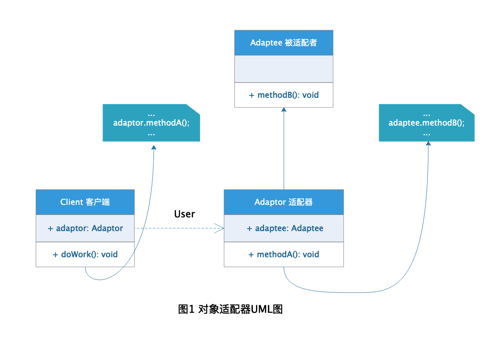
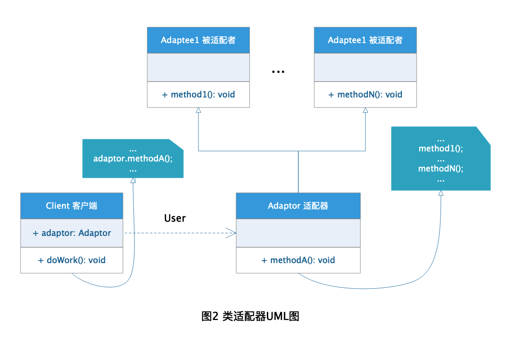
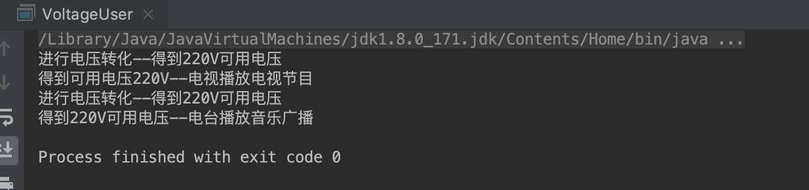

# Adapter 适配器模式

适配器这个概念起源于电工学，我们平时使用的家用电器一般都是220v 电压的，但是由于地区供电电压的不同，比如有些地区电压只有200v, 有些地区电压却有240v,这样的
电压家用电器肯定没法直接适用的。那怎么办呢，难道让供电厂修改提供的电压或者让电器厂生产能使用特定电压的电器嘛？这肯定是不现实的，于是适配器就出现了。适配器
就是做这样的工作--将不统一的电压都统一输出为220v，这样我们使用家电时就可以直接使用供电了。借用这样的概念，在软件开发工程中总结出了**适配器模式**。

## 定义

[适配器模式](https://zh.wikipedia.org/wiki/%E9%80%82%E9%85%8D%E5%99%A8%E6%A8%A1%E5%BC%8F) 在维基百科上的定义是这样的：

> **适配器模式：** 将一个类的接口转接成用户所期待的。一个适配使得因接口不兼容而不能在一起工作的类能在一起工作，做法是将类自己的接口包裹在一个已存在的类中。

## 分类

在 Gof 的设计模式中，对适配器模式分为两种类型：

+ **对象适配器模式** 在这种适配器模式中，适配器容纳一个它包裹的类的实例。在这种情况下，适配器调用被包裹对象的物理实体。



+ **类适配器模式** 这种适配器模式下，适配器继承自已实现的类（一般多重继承）。



由于C 、VB 、 Java 等编程语言都不支持多继承，所以这里主要介绍对象适配器模式。

## 角色分析

从图1 的对象适配器模式UML 类图中可以看出，对象适配器模式主要分为两种角色：

+ **Adaptee 被适配者：** 客户期待使用的类或者接口，无法直接使用并且因为某些原因无法进行修改。

+ **Adaptor 适配器：** 转换类或者接口，将客户无法直接适使用的类或者接口转换为所需要的类或者接口。

## 适用场景分析

在进行软件系统开发过程中，最好的方式就是在开发前期的设计阶段针对系统后期的可扩展性和可维护性进行综合考虑设计，但是系统设计不可能做到面面俱到，
所以在系统后期针对系统稳定性或者其他因素无法修改源程序的情况（也不建议直接修改源程序，不符合软件设计的"开闭原则"），可以考虑适用适配器模式对程序
进行扩展和维护，这是适配器模式常用的开发场景。

## 示例

下面还是以家用电器为栗子介绍适配器模式的使用。

### Adaptee 被适配者

电器抽象播放接口：

```java
public interface Adaptee {

    /**
     * 家用电器的播放方法
     */
    void play();
}
```

具体被适配者--电视机：

```java
public class Television implements Adaptee {

    /**
     * 电视机的播放方法
     */
    @Override
    public void play() {
        System.out.println("得到可用电压220V--电视播放电视节目");
    }
}
```

具体被适配者--广播电台：

```java
public class Radio implements Adaptee {

    /**
     * 广播电台的播放方法
     */
    @Override
    public void play() {
        System.out.println("得到220V可用电压--电台播放音乐广播");
    }
}
```

### Adaptor 适配器

电压适配器：

```java
public class VoltageAdaptor {

    /**
     * 私有的被适配者对象
     */
    private Adaptee adaptee;

    /**
     * 构造函数传入适配者对象
     * @param adaptee 被适配者对象
     */
    public VoltageAdaptor(Adaptee adaptee) {
        this.adaptee = adaptee;
    }

    /**
     * 转换电压并执行电器播放方法
     */
    public void doPlay() {
        System.out.println("进行电压转化--得到220V可用电压");
        adaptee.play();
    }
}
```

### Client 客户端

电压使用用户：

```java
public class VoltageUser {

    /**
     * 这里模拟的是适用电器的普通用户
     * 使用的电压不一定是220V
     * 但是通过电压适配器转换后可以正常使用电器
     */
    public static void main(String[] args) {
        //播放电视
        VoltageAdaptor televisionAdaptor = new VoltageAdaptor(new Television());
        televisionAdaptor.doPlay();

        //播放广播
        VoltageAdaptor radioAdaptor = new VoltageAdaptor(new Radio());
        radioAdaptor.doPlay();
    }
}
```

### 结果




