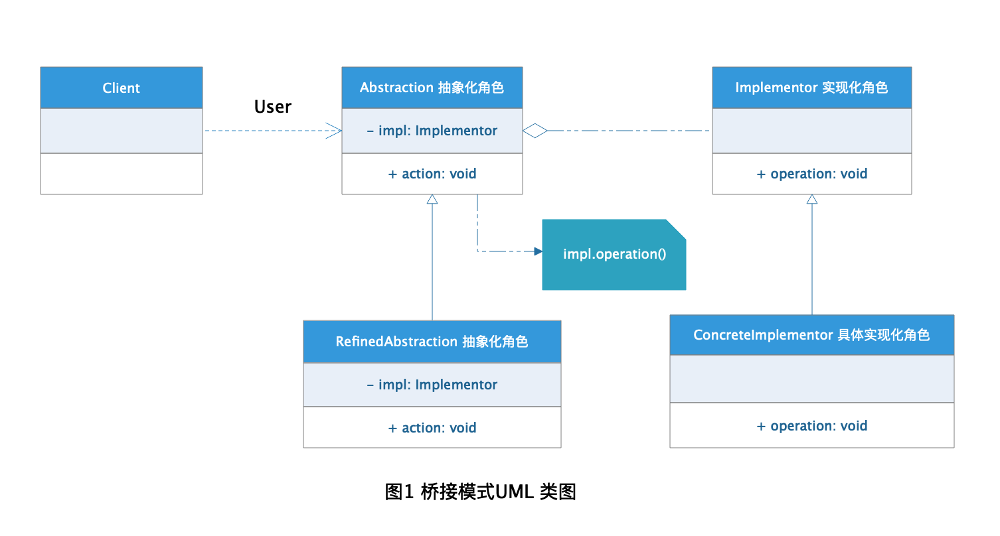
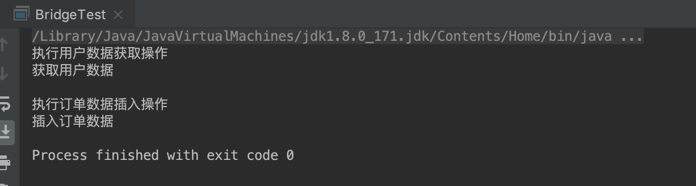

# Bridge 桥接模式

在程序开发过程中我们经常会用到继承的概念，但是在Java 中不支持多继承，这样导致多继承设计方案就会变得很复杂，代码之间的耦合度太高不利于扩展，于是基于"合成/聚合复用原则"设计原则的应用，针对这种应用场景的系统推出了新的设计模式--这就是桥接模式。

## 定义

**桥接模式：** 将抽象部分与它的实现部分分离，使它们都可以独立地变化。它是一种对象结构型模式，又称为柄体(Handle and Body)模式或接口(Interfce)模式。

## 意图

【GOF95】在提出桥梁模式的时候指出，桥梁模式的用意是"将抽象化(Abstraction)与实现化(Implementation)脱耦，使得二者可以独立地变化"。这句话有三个关键词，也就是抽象化、实现化和脱耦。

### 抽象化

存在于多个实体中的共同的概念性联系，就是抽象化。作为一个过程，抽象化就是忽略一些信息，从而把不同的实体当做同样的实体对待。简单点说抽象化在我看来就是将某些不同事物之间的共同点脱离事物本身来考虑从而原本不同的事物可以当作统一个事物。比如：电脑、汽车、菜刀这三个东西，具体来看它们是单独的东西，但是宏观的来看它们都属于人用来完成某些意图的工具，所以在人造工具这个概念上它们是同一事物，而人造工具这个概念就属于抽象化。

### 实现化

抽象化给出的具体实现，就是实现化。实现化和抽象化是两个相反的概念，抽象化是从宏观全局等大的概念上考虑得到的，那么实现化就关注事物本身的具体细节和区别点。比如：自行车、汽车从抽象的概念上都属于车这个概念，但是从实现化的角度来看，自行车需要人来提供动力；汽车靠发动机提供动力，从这个区别点来说它们都属于车的实现化。

### 脱耦

所谓耦合，就是两个实体的行为的某种强关联。而将它们的强关联去掉，就是耦合的解脱，或称脱耦。在这里，脱耦是指将抽象化和实现化之间的耦合解脱开，或者说是将它们之间的强关联改换成弱关联。

在程序设计开发过程中，类的继承关系就属于强关联，父类有什么改动子类也需要跟着改动，这种强关联的应用在软件设计中不建议使用，因为这不符合"开闭原则"，不利于系统的可扩展性。相对的更推荐的是组合/聚合的弱关联应用，这也是程序设计的"合成/聚合复用原则"。

+ 组合：表示一个整体与部分的关系，指一个依托整体而存在的关系（整体与部分不可以分开）。比如：人都有手脚，手脚是人的一部分并且脱离人就没有意义，人和手脚之间就是组合关系。

+ 聚合：聚合是比合成关系更弱的一种拥有关系,也表示整体与部分的关系（整体与部分可以分开）。比如：汽车都有引擎、轮胎，引擎、轮胎是汽车的一部分但是没有汽车引擎、轮胎还是单独的物体，汽车和引擎、轮胎之间就是聚合关系。

## 角色分析



从图1中可以看出，桥接模式涉及到的角色有以下几种：

+ **抽象化(Abstraction)角色：** 抽象化给出的定义，并保存一个对实现化对象的引用。

+ **修正抽象化(Refined Abstraction)角色：** 扩展抽象化角色，改变和修正父类对抽象化的定义。

+ **实现化(Implementor)角色：** 这个角色给出实现化角色的接口，但不给出具体的实现。必须指出的是，这个接口不一定和抽象化角色的接口定义相同，实际上，这两个接口可以非常不一样。实现化角色应当只给出底层操作，而抽象化角色应当只给出基于底层操作的更高一层的操作。

+ **具体实现化(Concrete Implementor)角色：** 这个角色给出实现化角色接口的具体实现。

## 示例

下面已开发中常用到的数据库操作为栗子演示下桥接模式的应用。

### 抽象化(Abstraction)角色

```java
public abstract class BaseService {

    /**
     * 实现化角色
     */
    protected BaseDao baseDao;

    /**
     * 设置具体实现化角色
     * @param baseDao
     */
    public void setBaseDao(BaseDao baseDao) {
        this.baseDao = baseDao;
    }

    /**
     * 抽象新增方法
     */
    public abstract void insert();

    /**
     * 抽象删除方法
     */
    public abstract void delete();

    /**
     * 抽象更新方法
     */
    public abstract  void update();

    /**
     * 抽象获取方法
     */
    public abstract  void get();
}
```

### 修正抽象化(Refined Abstraction)角色

```java
public class UserServiceImpl extends BaseService {

    @Override
    public void insert() {
        System.out.println("执行用户数据插入操作");
        this.baseDao.insert();
    }

    @Override
    public void delete() {
        System.out.println("执行用户数据删除操作");
        this.baseDao.delete();
    }

    @Override
    public void update() {
        System.out.println("执行用户数据更新操作");
        this.baseDao.update();
    }

    @Override
    public void get() {
        System.out.println("执行用户数据获取操作");
        this.baseDao.get();
    }
}

public class OrderServiceImpl extends BaseService {

    @Override
    public void insert() {
        System.out.println("执行订单数据插入操作");
        this.baseDao.insert();
    }

    @Override
    public void delete() {
        System.out.println("执行订单数据删除操作");
        this.baseDao.delete();
    }

    @Override
    public void update() {
        System.out.println("执行订单数据更新操作");
        this.baseDao.update();
    }

    @Override
    public void get() {
        System.out.println("执行订单数据获取操作");
        this.baseDao.get();
    }
}
```

### 实现化(Implementor)角色

```java
public interface BaseDao {

    /**
     * 插入数据方法
     */
    void insert();

    /**
     * 删除数据方法
     */
    void delete();

    /**
     * 更新数据方法
     */
    void update();

    /**
     * 获取数据方法
     */
    void get();
}
```

### 具体实现化(Concrete Implementor)角色

```java
public class UserDaoImpl implements DBDao {

    @Override
    public void insert() {
        System.out.println("插入用户数据");
    }

    @Override
    public void delete() {
        System.out.println("删除用户数据");
    }

    @Override
    public void update() {
        System.out.println("更新用户数据");
    }

    @Override
    public void get() {
        System.out.println("获取用户数据");
    }
}

public class OrderDaoImpl implements DBDao {

    @Override
    public void insert() {
        System.out.println("插入订单数据");
    }

    @Override
    public void delete() {
        System.out.println("删除订单数据");
    }

    @Override
    public void update() {
        System.out.println("更新订单数据");
    }

    @Override
    public void get() {
        System.out.println("获取订单数据");
    }
}

```
### 测试

```java
public class BridgeTest {

    public static void main(String[] args) {
        //查询用户数据
        BaseDao userDao = new UserDaoImpl();
        BaseService userService = new UserServiceImpl();
        userService.setBaseDao(userDao);
        userService.get();
        System.out.println();

        //插入订单数据
        BaseDao orderDao = new OrderDaoImpl();
        BaseService orderService = new OrderServiceImpl();
        orderService.setBaseDao(orderDao);
        orderService.insert();
    }
}
```

### 结果



## 优点

+ 分离抽象接口以及实现，实现细节对客户透明。

+ 使用组合/聚合方案，提高系统灵活性，有助于系统扩展。

+ 完美的替代多继承方案，极大的减少了子类的个数。

## 缺点

+ 由于抽象的大量使用，增加了系统设计难度，需要对系统有全面的理解。

+ 需要识别出系统中的维度变化，这考验设计人员的设计经验与能力。