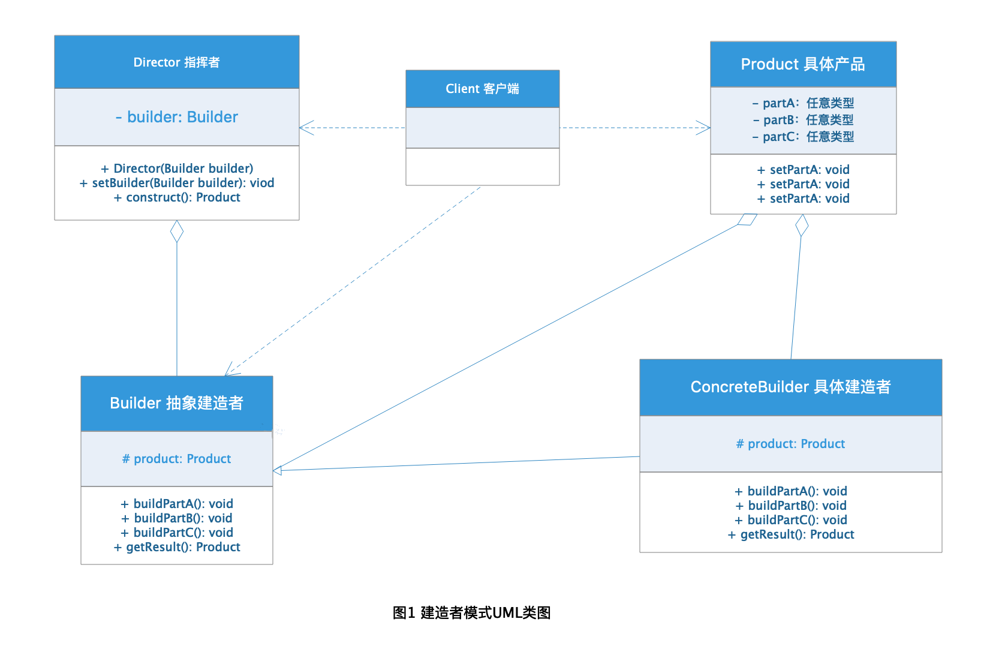

# Builder Pattern 建造者模式

我们在日常生活中总会有这样的需求：我们需要某个产品，比如电脑、电视机、汽车等，但作为消费者我们并
不关心这些产品是怎样生产出来的，我们更关心的是产品本身，而类似的产品都有类似的组装过程，例如台式
电脑和笔记本电脑都需要CPU、硬盘、硬盘、主板、显卡、显示器、电源这些部分组成，那么这类产品的生成
过程都是类似的，我们可以把类似的产品创建过程和产品本身分离，这种模式在开发中被总结为建造模式。

## 定义

**建造者模式：** 是指将一个负责对象的创建和表示分离，使得类似的创建方式可以生成不同的表示的模式。

## 优点

1. 使用者不被关心产品内部细节，使得产品的创建和产品本身进行了解耦，相同的创建过程可以生产不同的产品。
2. 由于产品建造者之间是解耦的，所以很方便进行扩展，需要什么新产品，只需要增加新的建造者即可，符合"开闭原则"。
3. 对产品创建过程进行拆分可以对产品的创建进行更细粒度的控制。

## 缺点

1. 对产品创建过程进行更细粒度的控制会造成复杂度的增加，一个产品如果需要多个组件则需要多个建造者。
2. 创造模式注重的是产品的组装过程所以需要类似的组装步骤才可以使用相同的建造者，产品之间差异太大的情况
则无法使用，例如汽车的创建和电脑的创建组成不同，无法使用建造者模式进行抽象。

## 角色分析



图1是建造者模式的UML类图，结合类图分析可知建造者模式包含四种角色：Product 具体产品、Builder 抽象建造者、
Concrete Builder 具体建造者、Director 指挥者。

下面结合电脑的示例具体一一介绍。

### Product 具体产品

**Product 具体产品：** 具体的一类产品对象，可以由多个不同的组成部件组成。

```java
public class Computer {

    private String cpu;

    private String harddisk;

    private String monitor;

    public String getCpu() {
        return cpu;
    }

    public void setCpu(String cpu) {
        this.cpu = cpu;
    }

    public String getHarddisk() {
        return harddisk;
    }

    public void setHarddisk(String harddisk) {
        this.harddisk = harddisk;
    }

    public String getMonitor() {
        return monitor;
    }

    public void setMonitor(String monitor) {
        this.monitor = monitor;
    }

    public String getComputerInfo() {
        return "Computer: { cpu: " + this.cpu + ", harddisk： " +  this.harddisk + ", monitor: " + this.monitor + "}";
    }
}

```

### Builder 抽象建造者

**Builder 抽象建造者：** 为产品的创建过程提供定义，定义了产品的创建方法，以及返回产品对象的方法。

```java
public abstract class ComputerBuilder {

    protected Computer computer = new Computer();

    public abstract void buildCPU();

    public abstract void buildHarddis();

    public abstract void buildMonitor();

    public Computer getComputer() {
        return computer;
    }
}

```

### Concrete Builder 具体建造者

**Concrete Builder 具体建造者：** 实现了抽象创建者定义的产品创建过程，生产具体的一类产品。

```java
public class DesktopComputerBuilder extends ComputerBuilder {

    @Override
    public void buildCPU() {
        computer.setCpu("台式电脑 CPU");
    }

    @Override
    public void buildHarddis() {
        computer.setHarddisk("台式电脑硬盘");
    }

    @Override
    public void buildMonitor() {
        computer.setMonitor("台式电脑显示起");
    }
}


public class LaptopComputerBuilder extends ComputerBuilder {

    @Override
    public void buildCPU() {
        computer.setCpu("笔记本电脑 CPU");
    }

    @Override
    public void buildHarddis() {
        computer.setHarddisk("笔记本电脑硬盘");
    }

    @Override
    public void buildMonitor() {
        computer.setMonitor("笔记本电脑显示起");
    }
}

```

### Director 指挥者

**Director 指挥者：** 使用建造者的对象，用于通过建造者生成具体的复杂产品，主要有两个作用：

1. 隔离客户与复杂产品对象的生产过程。
2. 负责控制复杂产品对象的生产过程。

```java
public class ComputerDirector {

    private ComputerBuilder builder;


    /**
     * 通过setter 方法注入建造者对象
     * @param builder 具体的建造者
     */
    public void setBuilder(ComputerBuilder builder) {
        this.builder = builder;
    }

    /**
     * 通过构造方法注入建造者对象
     * @param builder 具体的建造者
     */
    public ComputerDirector(ComputerBuilder builder) {
        this.builder = builder;
    }

    /**
     * 组装电脑
     * @return
     */
    public Computer construct() {
        builder.buildCPU();
        builder.buildHarddis();
        builder.buildMonitor();
        return builder.getComputer();
    }
    
     public ComputerDirector() {
    }
}
```

### 示例

下面通过一个main 函数演示电脑这类产品的建造者模式应用：

```java
public class ComputerClient {

    public static void main(String[] args) {

        ComputerBuilder desktopBuilder = new DesktopComputerBuilder();
        ComputerDirector director = new ComputerDirector(desktopBuilder);
        Computer desktop = director.construct();
        System.out.println(desktop.getComputerInfo());

        ComputerBuilder laptopBuilder = new LaptopComputerBuilder();
        director.setBuilder(laptopBuilder);
        Computer laptop =  director.construct();
        System.out.println(laptop.getComputerInfo());

    }
}
```


## 应用场景

建造者模式适用于复杂产品的创建，复杂产品虽然由多个组成部分组成但是创建的过程步骤却相对稳定不变这种场景，
可以根据具体需求自行判断是否适合使用建造者模式。


