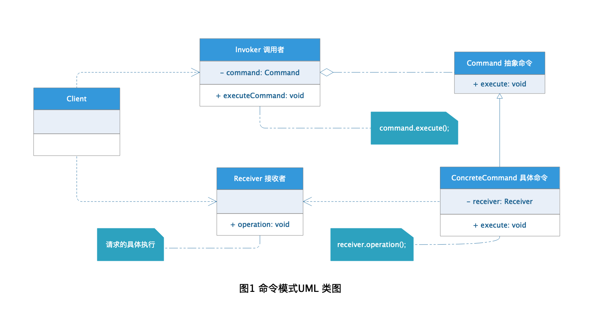
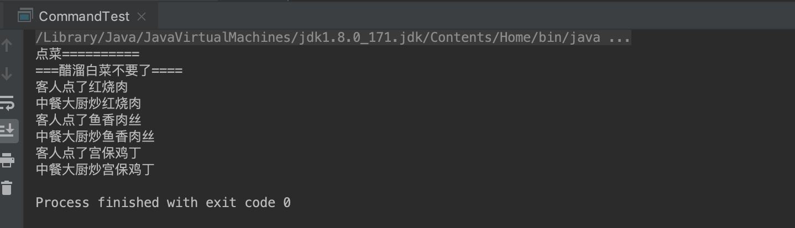

# Command Pattern 命令模式

在软件系统中，“行为请求者”与“行为实现者”通常呈现一种“紧耦合”。但在某些场合，比如要对行为进行“记录、撤销/重做、事务”等处理，这种无法抵御变化的紧耦合是不合适的。在这种情况下，如何将“行为请求者”与“行为实现者”解耦？将一组行为抽象为对象，实现二者之间的松耦合。这就是命令模式（Command Pattern）。 

## 定义

> **命令模式：** 将一个请求封装成一个对象，从而使你可用不同的请求对客户进行参数化：对请求排队或记录日志，以及支持可撤销的操作。

简单的来说，**命令模式** 就是将请求以命令的形式包裹在对象中，并传给调用对象。调用对象寻找可以处理该命令的合适的对象，并把该命令传给相应的对象，让该对象执行命令。

## 角色分析



从图1的命令模式UML 类图中可以看出，命令模式包含下面几种角色：

+ **Command 抽象命令：** 用来声明执行请求的接口或抽象类。

+ **ConcreteCommand 具体命令：** 处理某种具体请求，含有以一个请求接受者的引用用处处理具体请求。

+ **Invoker 调用者：** 用于将具体请求当成命令发送给请求接受者，使的请求能够正确处理。

+ **Receiver 接收者：** 请求的实际处理者

## 示例

下面以去餐厅点餐为栗子演示命令模式的应用：

### Command 抽象命令

```java
public abstract class Meal {

    /**
     * 菜名
     */
    private String meal;

    public void setMeal(String meal) {
        this.meal = meal;
    }

    public String getMeal() {
        return meal;
    }

    /**
     * 点餐命令
     * @param meal
     */
    public abstract void orderMeal(String meal);
}
```

### ConcreteCommand 具体命令

```java
public class ChineseMeal extends Meal {

    /**
     * 大厨
     */
    private Chef chef;

    public ChineseMeal(Chef chef) {
        this.chef = chef;
    }

    @Override
    public void orderMeal(String meal) {
        System.out.println("客人点了" + meal);
        chef.cookMeal(meal);
    }
}
```

### Invoker 调用者

```java
public class Waiter {

    /**
     * 点菜单
     */
    private List<Meal> orderdMeals = new ArrayList<Meal>();

    /**
     * 点菜
     * @param meal
     */
    public void order(Meal meal) {
        orderdMeals.add(meal);
    }

    /**
     * 取消点菜
     * @param meal
     */
    public void cancle(Meal meal) {
        orderdMeals.remove(meal);
    }

    /**
     * 下单
     */
    public void orderMeal() {
        if (!orderdMeals.isEmpty()) {
            orderdMeals.forEach(meal -> meal.orderMeal(meal.getMeal()));
        }
    }
}
```

### Receiver 接收者

```java
public interface Chef {

    /**
     * 炒菜方法
     * @param meal
     */
    void cookMeal(String meal);
}

public class ChineseChef implements Chef {

    @Override
    public void cookMeal(String meal) {
        System.out.println("中餐大厨炒" + meal);
    }
}
```

### 测试

```java
public class CommandTest {

    public static void main(String[] args) {
        System.out.println("点菜==========");
        Chef chineseChef = new ChineseChef();
        Meal meal = new ChineseMeal(chineseChef);
        meal.setMeal("红烧肉");
        Waiter waiter = new Waiter();
        waiter.order(meal);

        Meal meal1 = new ChineseMeal(chineseChef);
        meal1.setMeal("鱼香肉丝");
        waiter.order(meal1);

        Meal meal2 = new ChineseMeal(chineseChef);
        meal2.setMeal("宫保鸡丁");
        waiter.order(meal2);

        Meal meal3 = new ChineseMeal(chineseChef);
        meal3.setMeal("醋溜白菜");
        waiter.order(meal3);
        System.out.println("===醋溜白菜不要了====");
        waiter.cancle(meal3);
        waiter.orderMeal();
    }
}
```

### 结果



## 应用场景

+ 系统需要支持撤销和恢复操作的应用场景。

+ 系统需要对请求进行组合操作的应用场景。

+ 系统膨胀需要对系统进行改造拆分解耦的应用场景。

+ 系统需要将请求的发起、等待、处理异步的进行的应用场景。

## 优点

+ 将请求调用者和处理者进行否分，降低了系统耦合。

+ 增加了系统灵活性，新的命令可以很容易加到系统中。

+ 可以很容易对命令进行组合处理。

+ 可以很方便的进行日志记录。

+ 支持对请求的撤销和恢复，即对统一请求可以不同处理方式。

## 缺点

命令模式不适用于系统设计初期基于猜测进行的开发，因为这样会导致大量无用的命令类产生，更好的方式是在系统业务需要时，使用命令模式进行改造。

命令模式的缺点有下面这些：

+ 系统命令的拆分可能导致大量命令类的产生。

+ 每种请求都要有一个具体的命令类来进行处理。