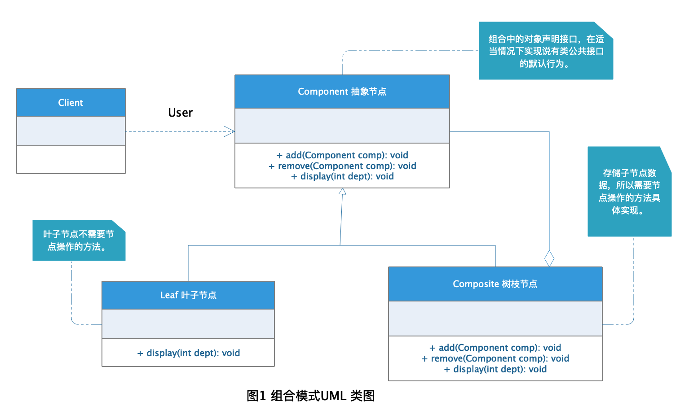

# Composite 组合模式

我们在解决平时开发中遇到的树形结构问题中，比如常遇到的组织机构树的设计，我们希望把所有组织节点都能简单使用但又保留它们之间的层级关系，这种将简单元素和复杂元素之间模糊处理的设计模式就是**组合模式**。

## 定义

**组合模式：** 将对象组合成树形结构以表示“部分-整体”的层次结构，组合模式使得用户对单个对象和组合对象的使用具有一致性。掌握组合模式的重点是要理解清楚 “部分/整体” 还有 ”单个对象“ 与 "组合对象" 的含义。

## 角色分析



从图1中可以看出，组合模式涉及到的角色有以下几种：

+ **Component 抽象节点：** 是组合中的对象声明接口，在适当的情况下，实现所有类共有接口的默认行为。声明一个接口用于访问和管理Component子部件。

+ **Leaf 叶子节点：** 在组合中表示叶子结点对象，叶子结点没有子结点。

+ **Composite 树枝节点：** 定义有枝节点行为，用来存储子部件，在Component接口中实现与子部件有关操作，如增加(add)和删除(remove)等。

## 示例

下面以组织机构树的设计作为栗子演示组合模式的应用：

### Component 抽象节点

```java

```

### Leaf 叶子节点

```java

```

### Composite 树枝节点

```java

```

### 测试

```java

```

### 结果

## 应用场景

组合模式解耦了客户程序与复杂元素内部结构，从而使客户程序可以像处理简单元素一样来处理复杂元素。所以下面列举的这些场景比较适合使用组合模式。

+ 遇到部分与整体这种概念的应用。

+ 需要创建层次结构并可以在其中以相同的方式对待所有元素的场景。

## 优点

+ 高层模块调用简单。

+ 节点可以自由增减。

## 缺点

在使用组合模式时，其叶子和树枝的声明都是实现类，而不是接口，违反了依赖倒置原则。