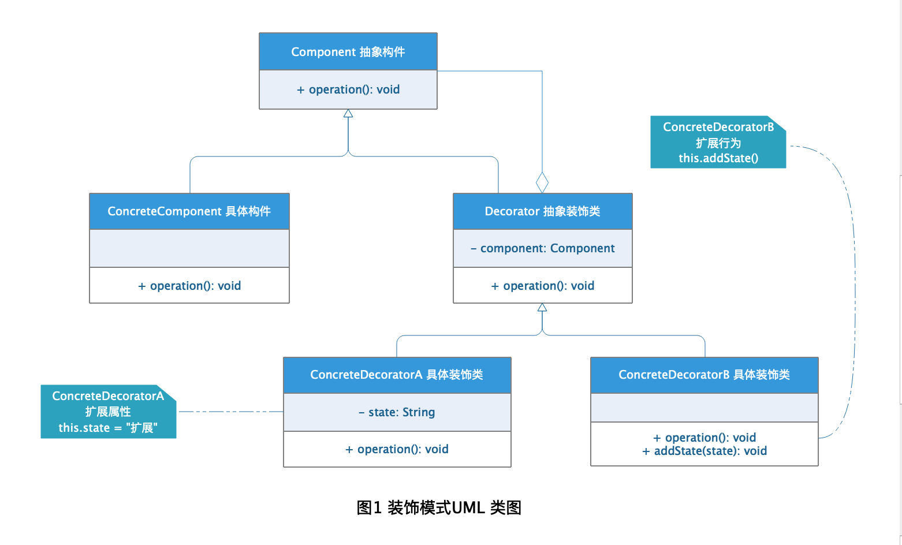

# Decorator Pattern 装饰模式

当我们需要对某类抽象对象进行扩展的时候，最简单的方法就是修改代码直接增加新的属性或者行为，但是在实际开发过程中是不允许这么做的，因为这违背了"开闭原则"，我们往往是通过扩展子类的方式来解决这个问题的。但是随着项目的扩展，项目中的子类膨胀增加，各个类的继承关系也变得复杂，系统维护变的困难，那有没有更好的办法呢？答案是有的，那就是使用装饰模式，动态的对对象进行扩展，这样就增加了系统扩展的灵活性。

## 定义

[装饰模式](https://zh.wikipedia.org/wiki/%E4%BF%AE%E9%A5%B0%E6%A8%A1%E5%BC%8F)在维基百科上的定义是这样的：

> **修饰模式** 是面向对象编程领域中，一种动态地往一个类中添加新的行为的设计模式。就功能而言，修饰模式相比生成子类更为灵活，这样可以给某个对象而不是整个类添加一些功能。

简单的来说：装饰模式是在不必改变原类文件和使用继承的情况下，动态地扩展一个对象的功能。

## 角色分析



从图1的装饰模式UML 类图中可以看出装饰模式包含下面几种角色：

+ **Component 抽象构件：**  抽象接口定义，用来规定需要增加的职责。

+ **ConcreteComponent 具体构件：** 具体的某个需要增加职责的类型，当具体类型只有一个的时候可以直接省略抽象构件。

+ **Decorator 抽象装饰类：** 持有一个被装饰类的实例，并定义相同的增加职责的方法用来对装饰类进行扩展。

+ **ConcreteDecorator 具体装饰类：** 具体的装饰类，给需要装饰的构件添加具体的新的职责，当只有一个装饰类的时候可以省略抽象装饰类。

## 示例

下面以餐厅点餐为栗子具体演示装饰类的应用：

### Component 抽象构件

```java
public interface Restaurant {

    /**
     * 点餐方法
     */
    void order();
}
```

### ConcreteComponent 具体构件

```java
public class KFC implements Restaurant {

    /**
     * 套餐
     */
    private String meal;

    public KFC() {
    }

    public KFC(String meal) {
        this.meal = meal;
    }

    @Override
    public void order() {
        System.out.println("在肯德基进行点餐：");
        if (null != meal) {
            if (meal.equalsIgnoreCase("a")) {
                hamburgAndChickenLeg();
            } else if (meal.equalsIgnoreCase("b")) {
                hamburgAndChickenWing();
            }
        }
    }

    public void hamburgAndChickenLeg() {
        System.out.println("套餐A：汉堡鸡腿套餐");
    }

    public void hamburgAndChickenWing() {
        System.out.println("套餐B：汉堡鸡翅套餐");
    }
}
```

### Decorator 抽象装饰类

```java
public class Meal implements Restaurant {

    /**
     * 含有抽象构件的实例
     */
    private Restaurant restaurant;

    public Meal(Restaurant restaurant) {
        this.restaurant = restaurant;
    }

    @Override
    public void order() {
        if (null != restaurant) {
            restaurant.order();
        }
    }
}
```

### ConcreteDecorator 具体装饰类

```java
public class Hamburger extends Meal {

    public Hamburger(Restaurant restaurant) {
        super(restaurant);
    }

    @Override
    public void order() {
        super.order();
        System.out.println("单点汉堡");
    }
}


public class ChickenWing extends Meal {

    public ChickenWing(Restaurant restaurant) {
        super(restaurant);
    }

    @Override
    public void order() {
        super.order();
        System.out.println("单点鸡翅");
    }
}

public class ChickenLeg extends Meal {

    public ChickenLeg(Restaurant restaurant) {
        super(restaurant);
    }

    @Override
    public void order() {
        super.order();
        System.out.println("单点鸡腿");
    }
}
```

### 测试

```java
public class DecoratorTest {

    public static void main(String[] args) {

        Restaurant kfc = new KFC();

        Restaurant meal = new Hamburger(kfc);
        meal.order();

        System.out.println();
        Restaurant kfcMeal = new KFC("a");
        kfcMeal.order();

    }
}
```

### 结果


## 应用场景

+ 需要对原有类型进行动态扩展的场景。

+ 需要对原有类增加职能但是又无法通过继承生成子类的方式实现的场景。

+ 需要对现有功能通过排列组合以生成不同结果的场景。

## 优点

+ 将类的装饰功能从类中去除可以大大简化类。

+ 将核型业务和装饰功能进行拆分，可以有效的去除相关类的重复装饰逻辑。

## 缺点

装饰功能的拆分意味着装饰类的增加，而装饰类之间设计到多层装饰的时候就会变的复杂，不同的装饰顺序可能产生不一样的效果，所以装饰模式的使用需要对装饰过程比较清晰。