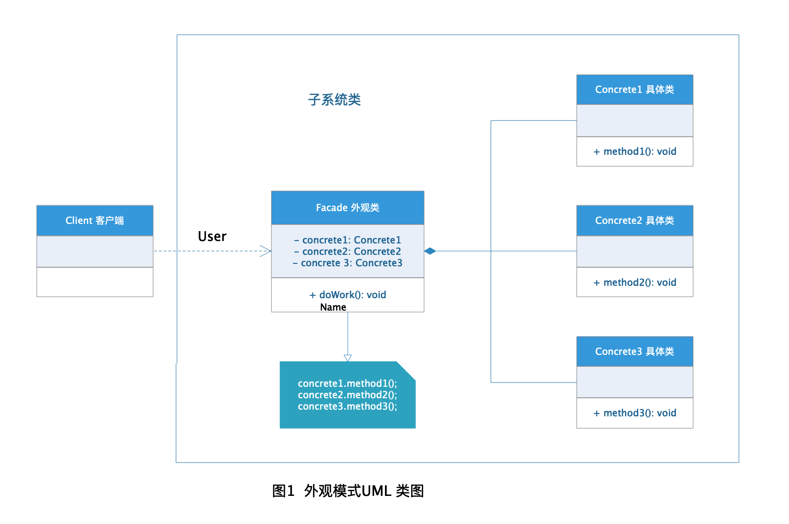
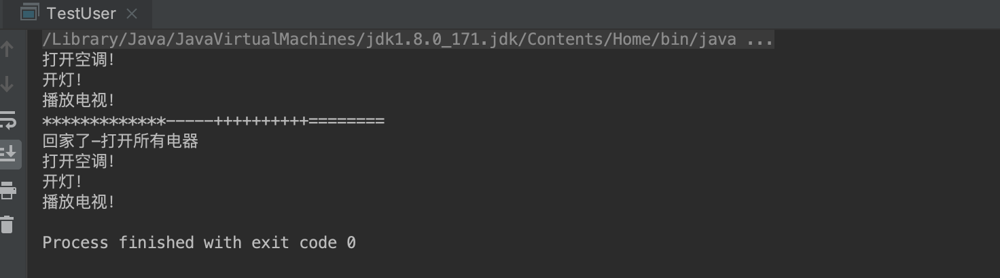

# Facade 外观模式

外观模式又叫门面模式，在实际开发过程中使用比较频繁的一个设计模式，外观模式主要是借助对象组合的概念将复杂繁琐的业务逻辑简单化，降低用户和实际业务直接的耦合，使得子系统更容易扩展和维护，客户端的使用也变得简单易用，因为客户端只需要使用外观类即可完成所需业务。

## 定义

[外观模式](https://zh.wikipedia.org/wiki/%E5%A4%96%E8%A7%80%E6%A8%A1%E5%BC%8F) 在维基百科上的定义是这样的：

> **外观模式（Facade pattern）** 是软件工程中常用的一种软件设计模式，它为子系统中的一组接口提供一个统一的高层接口，使得子系统更容易使用。

## 角色分析



+ **Facade 外观类：** 外观模式的核心，用于组合用户所需的具体类的操作，对用户操作进行隔离，代码层面解耦。

+ **Concrete 具体类：** 用户所需要的实际操作的类对象，作为外观类的成员变量被外观类所调用。


## 示例

下面以用户回家的场景为栗子演示外观模式的使用。

### Concrete 具体类

电灯类：

```java
public class Light {

    /**
     * 打开电灯方法
     */
    public void turnOn() {
        System.out.println("开灯！");
    }

    /**
     * 关闭电灯方法
     */
    public void turnOff() {
        System.out.println("关灯！");
    }
}

```

空调类：

```java
public class Conditioner {

    /**
     * 打开空调方法
     */
    public void onAir() {
        System.out.println("打开空调！");
    }

    /**
     * 关闭空调方法
     */
    public void offAir() {
        System.out.println("关闭空调");
    }
}
```

电视机类：

```java
public class TVBox {

    /**
     * 电视播放方法
     */
    public void play() {
        System.out.println("播放电视！");
    }

    /**
     * 电视关机方法
     */
    public void display() {
        System.out.println("关闭电视！");
    }
}
```

### Facade 外观类

用户操作类：

```java
public class UserOperate {

    /**
     * 家电私有组合
     */
    private Conditioner conditioner = new Conditioner();
    
    private Light light = new Light();
    
    private TVBox tvBox = new TVBox();

    /**
     * 打开电器方法
     */
    public void turnOnAll() {
        System.out.println("回家了-打开所有电器");
        conditioner.onAir();
        light.turnOn();
        tvBox.play();
    }
    
    public void turnOffAll() {
        System.out.println("出门了-关闭所有电器");
        conditioner.offAir();
        light.turnOff();
        tvBox.display();
    }
}
```

### Client 模拟用户

模拟用户类：

```java
public class TestUser {

    public static void main(String[] args) {
        //不用外观模式用户打开电器
        Conditioner conditioner = new Conditioner();
        conditioner.onAir();

        Light light = new Light();
        light.turnOn();

        TVBox tvBox = new TVBox();
        tvBox.play();

        System.out.println("*************-----++++++++++========");

        //使用外观模式用户打开电器
        UserOperate operate = new UserOperate();
        operate.turnOnAll();
    }
}
```

### 结果



## 外观模式于适配器模式

外观模式于适配器模式的概念和运用上很容易让人混淆，我自己在学习的时候也很容易搞混，所以这里特别讲下两者的区别：

+ 外观模式：对多个对象进行组合包装，简化类对象之间的操作，降低代码耦合。

+ 适配器模式：对单个对象进行包装，主要是因为无法直接使用目标对象，而特地针对所需对目标对象进行转化。

所以外观模式的关注点在于对象组合使用，而适配器模式的关注点在于对象适配转换，理解到这一点区别，在使用过程中就不会把二者搞混了。

