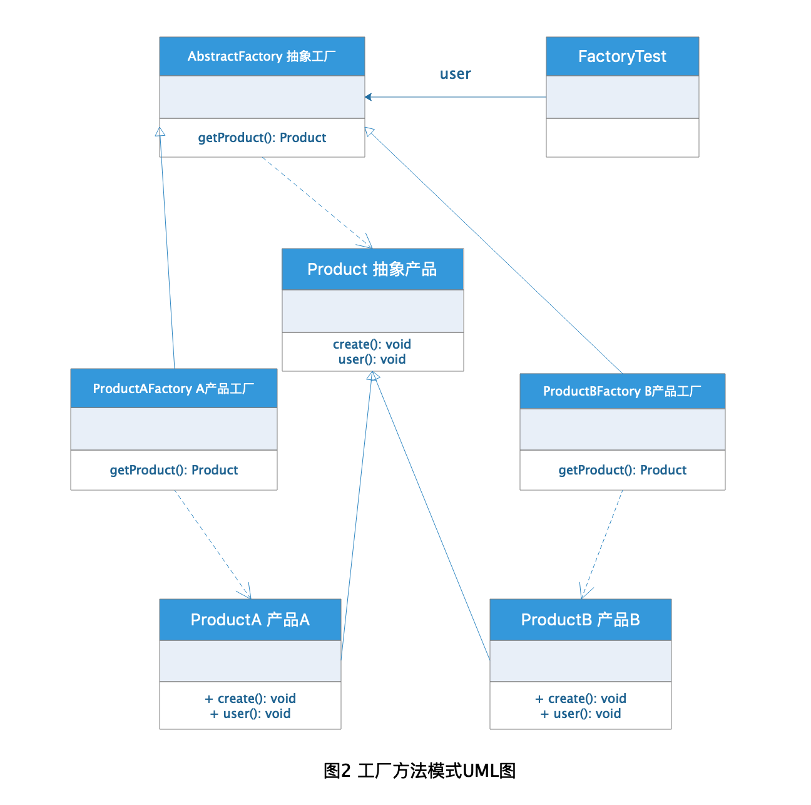
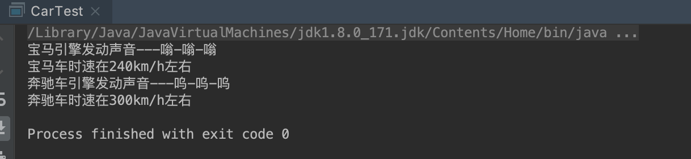

# 工厂模式

工厂模式是开发过程中用到的比较多的一种设计模式，工厂模式主要是对对象的创建过程进行控制的一种设计模式，
我们一般创建某个对象使用new 关键字进行创建，需要对对象进行一些初始化的工作时则需要借助构造函数，但是
如果一个类的创建初始化工作比较复杂的时候，单单依赖于构造函数进行初始化工作就会显得比较繁琐，也不符合开发
规范，这种情况下就总结出了工厂模式，对同类对象进行初始化创建管理。

## 定义

[工厂模式](https://zh.wikipedia.org/wiki/%E5%B7%A5%E5%8E%82%E6%96%B9%E6%B3%95) 在维基百科上的定义是这样的：

> **工厂方法模式（英语：Factory method pattern）** 是一种实现了“工厂”概念的面向对象设计模式。就像其他创建型模式一样，它也是处理在不指定对象具体类型的情况下创建对象的问题。工厂方法模式的实质是“定义一个创建对象的接口，但让实现这个接口的类来决定实例化哪个类。工厂方法让类的实例化推迟到子类中进行。

## 分类

工厂模式分成3类：

1. 简单工厂（Simple Factory）模式，又称静态工厂方法模式（Static Factory Method Pattern）。

2. 工厂方法（Factory Method）模式，又称多态性工厂（Polymorphic Factory）模式或虚拟构造子（Virtual Constructor）模式。

3. 抽象工厂（Abstract Factory）模式，又称工具箱（Kit 或Toolkit）模式。

## 简单工厂（Simple Factory）模式

简单工厂适用于创建比较复杂的单一对象，这里说是单一对象其实不太准确，我个人认为可以是一类对象，拥有类似
的初始化过程的对象，简单工厂就是把复杂对象的创建与适用解耦，客户端不再关注对象的创建过程而是注重对象的适用，
简单工厂虽然将对象的创建与适用解耦，但是违背了**开闭原则**，当需要增加类型的时候，需要修改工厂类的判断，这是
不符合开发规范的，虽然可以通过一些其他手段比如反射机制避免这种问题，但是还是要注意这种模式的特性。

### 角色分析


从上面的图1可以看出，简单工厂主要有以下3种角色：

1. 工厂(Factory)角色：用于创建具体产品，简单工厂模式的核心，封装类对产品的创建初始化逻辑，客户端直接调用使用。

2. 抽象产品(Product)角色：所有工厂产品的父类，用于定义产品的创建规范。

3. 具体产品(Concrete Product)角色：具体的产品，就是简单工厂创建的实际对象，客户端最终获得的可以使用的对象。

### 工厂(Factory)角色

```java
public class Factory {

    /**
     * 通过产品名称获得具体产品的静态方法
     * @param productName 产品名称
     * @return 具体产品
     */
    public static Product getProduct(String productName) {
        Product product = null;
        if (productName.equalsIgnoreCase("productA")) {
            product =  new ProductA();
            
            product.create();
        } else if (productName.equalsIgnoreCase("productB")) {
            product = new ProductB();
            
            product.create();
        }
        return product;
    }
}

```

### 抽象产品(Product)角色

```java
public interface Product {

    /**
     * 定义初始化方法
     */
    void create();

    /**
     * 使用产品方法
     */
    void use();
}

```

### 具体产品(Concrete Product)角色

```java
public class ProductA implements Product {

    /**
     * 构造函数
     */
    public ProductA() {
        System.out.println("ProductA");
    }

    /**
     * 初始化方法
     */
    @Override
    public void create() {
        //进行初始化逻辑
        System.out.println("ProductA 初始化完成");
    }

    /**
     * 使用产品
     */
    @Override
    public void use() {
        System.out.println("使用 ProductA");
    }
}

public class ProductB implements Product {

    /**
     * 构造函数
     */
    public ProductB() {
        System.out.println("ProductB");
    }

    /**
     * 初始化方法
     */
    @Override
    public void create() {
        //进行初始化逻辑
        System.out.println("ProductB 初始化完成");
    }

    /**
     * 使用产品
     */
    @Override
    public void use() {
        System.out.println("使用 ProductB");
    }
}
```

### Client 客户端

```java
public class FactoryClient {

    public static void main(String[] args) {
        //获取A产品
        Product productA = Factory.getProduct("productA");
        productA.use();

        //获取B产品
        Product productB = Factory.getProduct("productB");
        productB.use();
    }
}
```

### 结果


### 反射的方式改善简单工厂

```java
public class ReflectFactory {

    /**
     * 通过具体的产品class获得具体产品的静态方法
     * @param clazz 具体的产品class
     * @return 具体产品
     */
    public static Product getProduct(Class<? extends Product> clazz) {
        Product product = null;
        try {
            product = (Product) Class.forName(clazz.getName()).newInstance();
        } catch (InstantiationException e) {
            e.printStackTrace();
        } catch (IllegalAccessException e) {
            e.printStackTrace();
        } catch (ClassNotFoundException e) {
            e.printStackTrace();
        }
        return product;
    }
}
```

### 测试方法

```
//获取A产品
Product productA = ReflectFactory.getProduct(ProductA.class);
productA.use();

//获取B产品
Product productB = ReflectFactory.getProduct(ProductB.class);
productB.use();
```

**注意：** 这种方式虽然符合类**开闭原则**，但是每次创建产品都需要传入具体的产品class，这样显得比较复杂繁琐，可以通过配置文件方式解决这个问题。

## 工厂方法（Factory Method）模式

工厂方法模式是开发过程中使用工厂模式中最多的一种，很多优秀的框架都有使用，例如Spring 框架中就可以经常看到这种模式。

工厂方法模式不再像简单工厂一样只提供一种工厂用来创建类似的类对象，而是针对每类对象都有自己的工厂用来创建管理对象，这样对对象的管理将
更加细分化，也有利于类的扩展。

### 角色分析



从上面的图2可以看出，工厂方法模式主要有以下4种角色：

1. 抽象工厂(Abstract Factory)角色：用于规定工厂的生成产品方法，是工厂方法的核心，一般用抽象类或接口表示。

2. 具体工厂(Concrete Factory)角色：具体产品的工厂类，继承或实现抽象工厂的工厂方法，用于创建管理具体的产品。

3. 抽象产品(AbstractProduct)角色：和简单工厂一样，都是用于规定具体产品的创建过程。

4. 具体产品(Concrete Product)角色： 和简单工厂一样，是具体客户端使用的产品对象，由具体工厂统一创建。

### 抽象工厂(Abstract Factory)角色

```java
public interface AbstractFactory {

    /**
     * 定义获得产品的方法
     * @return 返回产品
     */
    Product getProduct();
}
```

### 具体工厂(Concrete Factory)角色
```java
public class ProductAFactory implements AbstractFactory{

    /**
     * 获取产品A
     * @return 返回产品A
     */
    @Override
    public Product getProduct() {
        return new ProductA();
    }
}

public class ProductBFactory implements AbstractFactory{

    /**
     * 获取产品B
     * @return 返回产品B
     */
    @Override
    public Product getProduct() {
        return new ProductB();
    }
}
```

## 测试类

由于抽象产品和具体产品的概念和简单工厂的一样，这里就不再继续展示代码，下面直接使用相同的产品进行测试，测试结果也是和之前的简单工厂一样，有兴趣的可以自行尝试，这里只展示下测试代码。

```java
public class FactoryTest {

    public static void main(String[] args) {
        //获取产品A并使用
        AbstractFactory productAFactory = new ProductAFactory();
        Product productA = productAFactory.getProduct();
        productA.use();

        //获取产品B并使用
        AbstractFactory productBFactory = new ProductAFactory();
        Product productB = productAFactory.getProduct();
        productB.use();
    }
}
```

## 简单工厂对比工厂方法模式

其实简单工厂模式可以看作工厂方法模式的一个特例，这样比较好理解，简单工厂是针对一类具有相同创建逻辑的产品进行统一管理的模式，所以只有一个工厂管理一类产品；工厂
方法模式在简单工厂的基础上进行扩展，针对每一类产品都有自己的工厂类，可以做到多不同类创建的更细粒度化控制，这样也增加了系统的扩展性，符合"开闭原则"，增加新的
产品只需要增加对应的产品工厂即可，但是并不是产品越多、产品工厂越多越好，个人认为越多就越会增加系统的复杂性，所以在具体使用过程中需要多方考虑。

## 抽象工厂（Abstract Factory）模式

抽象工厂模式是工厂模式中最不好理解的一种设计模式了，其实抽象工厂模式是工厂方法模式进一步深入思考实践后产生的一种设计模式，
就我个人的理解，抽象工厂可以看作生产一组有关联依赖关系的产品的工厂模式，不管是简单工厂模式还是工厂方法模式都是强调的一个工厂
只用来生产特定的一类产品，而抽象工厂模式下的工厂类是生产一组关联产品，何为关联产品？我这里举个栗子：我们平时使用的汽车，
一般汽车是由发动机、底盘、车身和电器设备几个大件组成的，这里的发动机、底盘、车身和电器设备就是汽车厂的关联产品，如果我们
只对单一产品通过工厂来创建这没问题，这样就会有发动机厂、底盘厂、车身厂和电器设备厂多个工厂类，而我们需要的产品是汽车并不是
这些零件，所以我们就需要工厂来组装这些零件生产汽车--这就是抽象出来的汽车厂，抽象工厂就是用来组装特定关联的产品生成所需产品的模式。


### 适用场景

1. 和其他工厂类一样，客户端不关心具体的产品生成细节只关心所需的产品。

2. 多个关联产品用于完成某种特定的需求或者生产某类所需的产品。

3. 生产流程固定，不需要新增类来改变所需产品的创建。

**注意：** 关于第三点很好理解，如果流程不固定，新增类就需要修改工厂的生产方法，不符合"开闭原则"。

### 角色分析

因为抽象工厂和工厂方法基本的思想是一致的，所以模式也分为四种角色：**抽象工厂(Abstract Factory)角色**、**具体工厂(Concrete Factory)角色**、**抽象产品(AbstractProduct)角色**、**具体产品(Concrete Product)角色**。

这里就不再给出UML类图和重复概念了，有兴趣的可以查看前面的工厂方法模式的角色分析。

### 示例

下面我就以汽车的相关代码作为示例：

#### 抽象产品汽车接口：

```java
public interface Car {

    /**
     * 汽车运动函数
     */
    void run();
}
```

#### 抽象产品引擎接口

```java
public interface Engine {

    /**
     * 发动引擎函数
     */
    void start();
}
```
 
#### 具体产品宝马车

```java
public class BMWCar implements Car {

    @Override
    public void run() {
        System.out.println("宝马车时速在240km/h左右");
    }
}
```

#### 具体产品奔驰车

```java
public class BenzCar implements Car {

    @Override
    public void run() {
        System.out.println("奔驰车时速在300km/h左右");
    }
}
```

#### 具体产品宝马引擎

```java
public class BMWEngine implements Engine {

    @Override
    public void start() {
        System.out.println("宝马引擎发动声音---嗡-嗡-嗡");
    }
}
```

#### 具体产品奔驰引擎

```java
public class BenzEngine implements Engine {

    @Override
    public void start() {
        System.out.println("奔驰车引擎发动声音---呜-呜-呜");
    }
}
```

#### 抽象工厂汽车厂

```java
public interface CarFactory {

    /**
     * 获取汽车
     * @return 汽车
     */
    Car getCar();

    /**
     * 获取引擎
     * @return 引擎
     */
    Engine getEngine();
}
```

#### 具体工厂宝马厂

```java
public class BMWFactory implements CarFactory {

    @Override
    public Car getCar() {
        return new BMWCar();
    }

    @Override
    public Engine getEngine() {
        return new BMWEngine();
    }
}
```

#### 具体工厂奔驰厂

```java
public class BenzFactory implements CarFactory {

    @Override
    public Car getCar() {
        return new BenzCar();
    }

    @Override
    public Engine getEngine() {
        return new BenzEngine();
    }
}
```

#### 测试类

```java
public class CarTest {

    public static void main(String[] args) {
        //宝马车工厂获取宝马车相关产品
        CarFactory bmwFactory = new BMWFactory();

        Car bmwCar = bmwFactory.getCar();
        Engine bmwEngine = bmwFactory.getEngine();

        bmwEngine.start();
        bmwCar.run();

        //奔驰车工厂获取奔驰车相关产品
        CarFactory benzFactory = new BenzFactory();

        Car benzCar = benzFactory.getCar();
        Engine benzEngine = benzFactory.getEngine();

        benzEngine.start();
        benzCar.run();
    }
}
```

#### 结果

