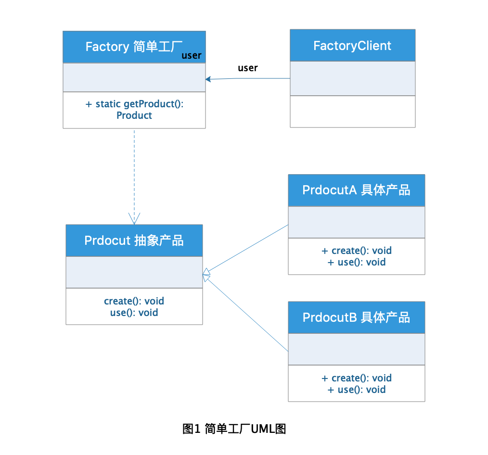
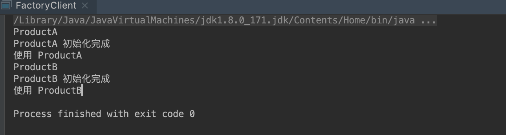

# 工厂模式

工厂模式是开发过程中用到的比较多的一种设计模式，工厂模式主要是对对象的创建过程进行控制的一种设计模式，
我们一般创建某个对象使用new 关键字进行创建，需要对对象进行一些初始化的工作时则需要借助构造函数，但是
如果一个类的创建初始化工作比较复杂的时候，单单依赖于构造函数进行初始化工作就会显得比较繁琐，也不符合开发
规范，这种情况下就总结出了工厂模式，对同类对象进行初始化创建管理。

## 定义

[工厂模式](https://zh.wikipedia.org/wiki/%E5%B7%A5%E5%8E%82%E6%96%B9%E6%B3%95) 在维基百科上的定义是这样的：

> **工厂方法模式（英语：Factory method pattern）** 是一种实现了“工厂”概念的面向对象设计模式。就像其他创建型模式一样，它也是处理在不指定对象具体类型的情况下创建对象的问题。工厂方法模式的实质是“定义一个创建对象的接口，但让实现这个接口的类来决定实例化哪个类。工厂方法让类的实例化推迟到子类中进行。

## 分类

工厂模式分成3类：

1. 简单工厂（Simple Factory）模式，又称静态工厂方法模式（Static Factory Method Pattern）。

2. 工厂方法（Factory Method）模式，又称多态性工厂（Polymorphic Factory）模式或虚拟构造子（Virtual Constructor）模式。

3. 抽象工厂（Abstract Factory）模式，又称工具箱（Kit 或Toolkit）模式。

## 简单工厂（Simple Factory）模式

简单工厂适用于创建比较复杂的单一对象，这里说是单一对象其实不太准确，我个人认为可以是一类对象，拥有类似
的初始化过程的对象，简单工厂就是把复杂对象的创建与适用解耦，客户端不再关注对象的创建过程而是注重对象的适用，
简单工厂虽然将对象的创建与适用解耦，但是违背了**开闭原则**，当需要增加类型的时候，需要修改工厂类的判断，这是
不符合开发规范的，虽然可以通过一些其他手段比如反射机制避免这种问题，但是还是要注意这种模式的特性。

### 角色分析



从上面的图1可以看出，简单工厂主要有以下3中角色：

1. 工厂(Factory)角色：用于创建具体产品，简单工厂模式的核心，封装类对产品的创建初始化逻辑，客户端直接调用使用。

2. 抽象产品(Product)角色：所有工厂产品的父类，用于定义产品的创建规范。

3. 具体产品(Concrete Product)角色：具体的产品，就是简单工厂创建的实际对象，客户端最终获得的可以使用的对象。

### 工厂(Factory)角色

```java
public class Factory {

    /**
     * 通过产品名称获得具体产品的静态方法
     * @param productName 产品名称
     * @return 具体产品
     */
    public static Product getProduct(String productName) {
        Product product = null;
        if (productName.equalsIgnoreCase("productA")) {
            product =  new ProductA();
            
            product.create();
        } else if (productName.equalsIgnoreCase("productB")) {
            product = new ProductB();
            
            product.create();
        }
        return product;
    }
}

```

### 抽象产品(Product)角色

```java
public interface Product {

    /**
     * 定义初始化方法
     */
    void create();

    /**
     * 使用产品方法
     */
    void use();
}

```

### 具体产品(Concrete Product)角色

```java
public class ProductA implements Product {

    /**
     * 构造函数
     */
    public ProductA() {
        System.out.println("ProductA");
    }

    /**
     * 初始化方法
     */
    @Override
    public void create() {
        //进行初始化逻辑
        System.out.println("ProductA 初始化完成");
    }

    /**
     * 使用产品
     */
    @Override
    public void use() {
        System.out.println("使用 ProductA");
    }
}

public class ProductB implements Product {

    /**
     * 构造函数
     */
    public ProductB() {
        System.out.println("ProductB");
    }

    /**
     * 初始化方法
     */
    @Override
    public void create() {
        //进行初始化逻辑
        System.out.println("ProductB 初始化完成");
    }

    /**
     * 使用产品
     */
    @Override
    public void use() {
        System.out.println("使用 ProductB");
    }
}
```

### Client 客户端

```java
public class FactoryClient {

    public static void main(String[] args) {
        //获取A产品
        Product productA = Factory.getProduct("productA");
        productA.use();

        //获取B产品
        Product productB = Factory.getProduct("productB");
        productB.use();
    }
}
```

### 结果




### 反射的方式改善简单工厂

```java
public class ReflectFactory {

    /**
     * 通过具体的产品class获得具体产品的静态方法
     * @param clazz 具体的产品class
     * @return 具体产品
     */
    public static Product getProduct(Class<? extends Product> clazz) {
        Product product = null;
        try {
            product = (Product) Class.forName(clazz.getName()).newInstance();
        } catch (InstantiationException e) {
            e.printStackTrace();
        } catch (IllegalAccessException e) {
            e.printStackTrace();
        } catch (ClassNotFoundException e) {
            e.printStackTrace();
        }
        return product;
    }
}
```

### 测试方法

```
//获取A产品
Product productA = ReflectFactory.getProduct(ProductA.class);
productA.use();

//获取B产品
Product productB = ReflectFactory.getProduct(ProductB.class);
productB.use();
```

**注意：** 这种方式虽然符合类**开闭原则**，但是每次创建产品都需要传入具体的产品class，这样显得比较复杂繁琐，可以通过配置文件方式解决这个问题。

## 工厂方法（Factory Method）模式

## 抽象工厂（Abstract Factory）模式