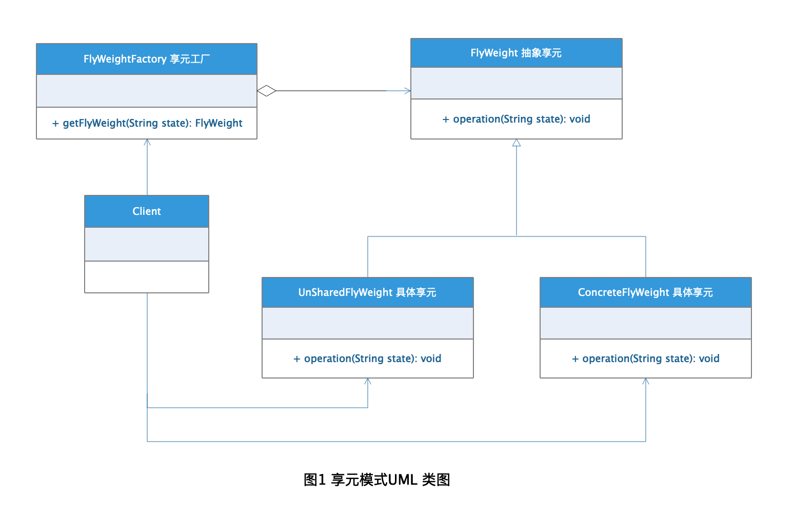
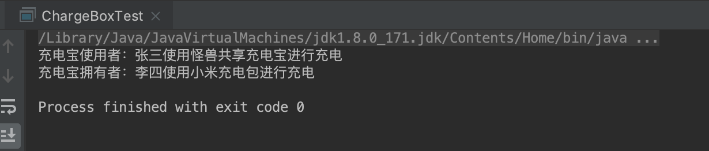

# Flyweight Pattern 享元模式

现在很流行共享这个概念，什么共享单车、共享汽车、共享充电宝之类的，其实共享这个概念在软件开发设计中早有应用，那就是享元模式。我们在开发中总会遇到不同客户需求都是类似的情况，这时候针对每个客户每个需求都单独进行开发这样肯定是不现实的，不仅代码重复度高还浪费部署运维这些成本，将这些公共的需求进行拆分共享，这样就能解决这个问题。

## 定义

[享元模式](https://zh.wikipedia.org/wiki/%E4%BA%AB%E5%85%83%E6%A8%A1%E5%BC%8F) 在维基百科上的定义是这样的：

> **享元模式（英语：Flyweight Pattern）** 是一种软件设计模式。它使用共享物件，用来尽可能减少内存使用量以及分享资讯给尽可能多的相似物件；它适合用于当大量物件只是重复因而导致无法令人接受的使用大量内存。通常物件中的部分状态是可以分享。常见做法是把它们放在外部数据结构，当需要使用时再将它们传递给享元。

简单来说：**享元模式（FlyWeight）**，运用共享技术有效的支持大量细粒度的对象。

## 角色分析



从图1的享元模式UML 类图中，可以看出享元模式有下面几种角色：

+ **FlyWeight 抽象享元：** 共享资源的抽象接口或抽象类。

+ **ConcreteFlyWeight 具体享元类：** 具体的某类共享资源类。

+ **UnSharedConcreteFlyWeight 非共享享元实现类：** 因为享元模式的应用把资源共享概念提取出来了，但是实际上肯定有些资源是不需要共享的，这些就用非共享实现类表示。

+ **FlyWeightFactory 享元工厂类：** 统一管理资源数据的使用。

## 内部状态 VS 外部状态

享元模式是对大量细粒度对象的共享技术应用，既然要使用细粒度对象那就必须对细粒度对象进行区分，这就涉及到内部状态和外部状态。

+ **内部状态** 指对象共享出来的信息，存储在享元对象内部并且不会随环境的改变而改变。

+ **外部状态** 指对象得以依赖的一个标记，是随环境改变而改变的、不可共享的状态

## 示例

下面以充电宝为栗子演示享元模式的应用：

### FlyWeight 抽象享元

```java
public interface ChargeBox {

    /**
     * 抽象充电方法
     */
    void charge();
}
```

### ConcreteFlyWeight 具体享元类

```java
public class MiChargeBox implements ChargeBox {

    /**
     * 充电宝拥有者
     */
    private String owner;

    /**
     * 构造方法 传入拥有者姓名
     * @param owner
     */
    public MiChargeBox(String owner) {
        this.owner = owner;
    }

    /**
     * 小米充电方法
     */
    @Override
    public void charge() {
        System.out.println("充电宝拥有者：" + this.owner + "使用小米充电包进行充电");
    }
}
```

### UnSharedConcreteFlyWeight 非共享享元实现类

```java
public class MonsterChargeBox implements ChargeBox {

    /**
     * 共享充电宝使用者
     */
    private String userName;

    /**
     * 构造函数出入使用者
     * @param userName
     */
    public MonsterChargeBox(String userName) {
        this.userName = userName;
    }

    @Override
    public void charge() {
        System.out.println("充电宝使用者：" + this.userName + "使用怪兽共享充电宝进行充电");
    }
}
```

### FlyWeightFactory 享元工厂类

```java
public class ChargeBoxFactory {

    private static ConcurrentHashMap<String, ChargeBox> allChargeBox = new ConcurrentHashMap<String, ChargeBox>();

    public static ChargeBox getChargeBox(String brand, String user) {

        if (allChargeBox.get(brand) == null) {

            synchronized (allChargeBox) {

                if (allChargeBox.get(brand) == null) {

                    if (brand.equalsIgnoreCase("monster")) {
                        ChargeBox monster = new MonsterChargeBox(user);
                        allChargeBox.put(brand, monster);
                    } else if (brand.equalsIgnoreCase("mi")) {
                        ChargeBox mi = new MiChargeBox(user);
                        allChargeBox.put(brand, mi);
                    }
                }
            }
        }
        return allChargeBox.get(brand);
    }
}

```

### 测试

```java
public class ChargeBoxTest {

    public static void main(String[] args) {

        ChargeBox monster = ChargeBoxFactory.getChargeBox("monster", "张三");
        monster.charge();

        ChargeBox mi = ChargeBoxFactory.getChargeBox("mi", "李四");
        mi.charge();
    }
}
```

### 结果



## 应用场景

+ 系统需要大量相似对象的使用的场景

+ 系统资源需要进行重复利用的场景

## 优点

享元模式通过将相似对象进行共享，可以大大减少对象的创建，从而减少了内存消耗，同时降低了对象创建与垃圾回收的开销，提高效率。

## 缺点

享元模式是通过内部状态和外部状态对享元进行管理的，要求将内部状态与外部状态分离，这使得程序的逻辑复杂化，增加了系统状态维护的成本。