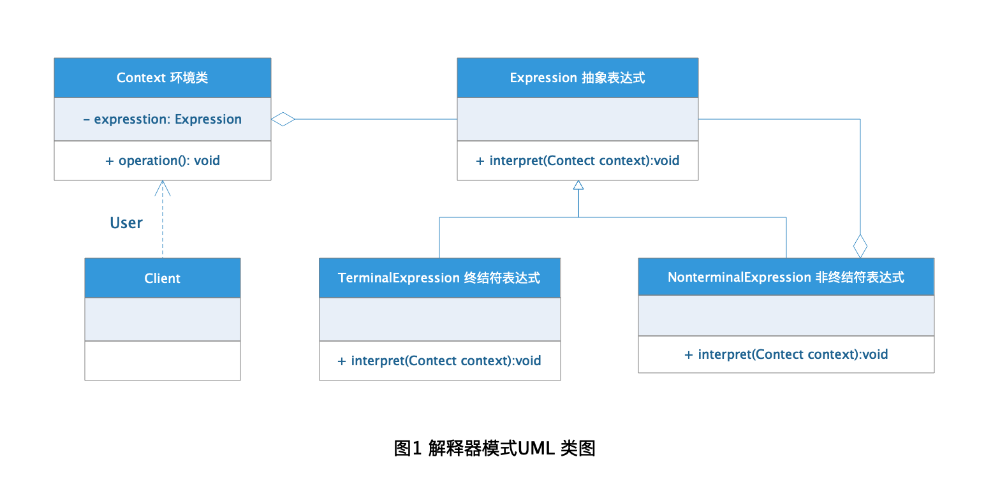
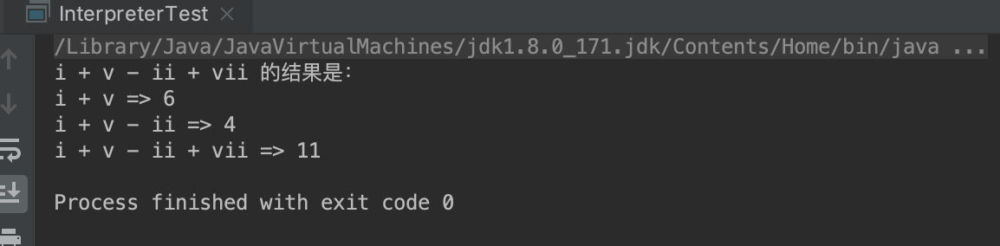

# Interpreter Pattern 解释器模式

以前学习文言文的时候总是不明白句子的意思，这时候经常会需要借助文言文字典将句子根据单词逐一翻译最终得到它的意思，在设计模式中这种方式的应用对应的一种设计模式就是--解释器模式。字典就是解释器，将我们不认识的单词解释为我们明白的意思。解释器模式的作用也是类似。

## 定义

**解释器模式：** 给定一个语言，定义它的文法的一种表示，并定义一个解释器，这个解释器使用这个表示来解释语言中的例子。

## 角色分析



+ **Expression 抽象表达式：** 定义一个抽象的解释接口，这个接口为抽象语法树中所有节点所共享。

+ **TerminalExpression 终结符表达式：** 实现了文法中的所有和终结符相关的解释操作，文法中的每一个终结符都有一个具体终结表达式与之相对应。

+ **NonterminalExpression 非终结符表达式：** 文法中的非终结符的解释操作，文法中的每一条规则都需要一个具体的非终结符表达式，非终结符表达式一般是文法中的运算符或者其他关键字。

+ **Context 环境类：** 它的任务一般是用来存放文法中各个终结符所对应的具体值，包含解释器以外的一些全局信息。

## 示例

下面以罗马自负加减运算为栗子演示解释器模式的应用：

### Expression 抽象表达式

```java
public interface Expression {

    int interpret(Context context);
}
```

### TerminalExpression 终结符表达式

```java
public class TerminalExpression implements Expression {

    private String variable;

    public TerminalExpression(String variable) {
        this.variable = variable;
    }

    @Override
    public int interpret(Context context) {
        return context.lookup(this);
    }
}
```

### NonterminalExpression 非终结符表达式

```java
public abstract class NonTerminalExpression implements Expression {


    Expression expression1, expression2;

    public NonTerminalExpression(Expression expression1, Expression expression2) {
        this.expression1 = expression1;
        this.expression2 = expression2;
    }
}

public class PlusExpression extends NonTerminalExpression {

    public PlusExpression(Expression expression1, Expression expression2) {
        super(expression1, expression2);
    }

    @Override
    public int interpret(Context context) {
        return this.expression1.interpret(context) + this.expression2.interpret(context);
    }
}

public class TerminalExpression implements Expression {

    private String variable;

    public TerminalExpression(String variable) {
        this.variable = variable;
    }

    @Override
    public int interpret(Context context) {
        return context.lookup(this);
    }
}
```

### Context 环境类

```java
public class Context {

    private Map<Expression, Integer> map = new HashMap<>();

    //定义变量
    public void add(Expression s, Integer value){
        map.put(s, value);
    }
    //将变量转换成数字
    public int lookup(Expression s){
        return map.get(s);
    }
}
```

### 测试

```java
public class InterpreterTest {

    public static void main(String[] args) {

        Context context = new Context();
        TerminalExpression i = new TerminalExpression("I");
        TerminalExpression ii = new TerminalExpression("II");
        TerminalExpression iii = new TerminalExpression("III");
        TerminalExpression iv = new TerminalExpression("IV");
        TerminalExpression v = new TerminalExpression("V");
        TerminalExpression vi = new TerminalExpression("VI");
        TerminalExpression vii = new TerminalExpression("VII");
        TerminalExpression viii = new TerminalExpression("VIII");
        TerminalExpression viiii = new TerminalExpression("VIIII");

        context.add(i, 1);
        context.add(ii, 2);
        context.add(iii, 3);
        context.add(iv, 4);
        context.add(v, 5);
        context.add(vi, 6);
        context.add(vii, 7);
        context.add(viii, 8);
        context.add(viiii, 9);

        System.out.println("i + v - ii + vii 的结果是：");
        System.out.println("i + v => " + new PlusExpression(i, v).interpret(context));
        System.out.println("i + v - ii => " + new MinusExpression(new PlusExpression(i, v), ii).interpret(context));
        int result = new PlusExpression(new MinusExpression(new PlusExpression(i, v), ii), vii).interpret(context);
        System.out.println("i + v - ii + vii => " +result);
    }
}
```

### 结果



这里只是借助罗马字符的加减运算简单演示解释器模式，其实可以这样去理解`i + v - ii + vii`就是我们需要进行解释的语句，而`i = 1, ii = 2 ...`这些是终结符表达式解释器，而`+ => 两个表达式相加， - => 两个表达式相减` 这些是非终结符表达式解释器，对语句进行解释时其实解释根据语法进行树形翻译，遇到终结符表达式则直接翻译，遇到非终结符表达式继续向下翻译知道遇到终结符表达式为止。

## 应用场景

如果一种特定类型的问题发生的频率足够高，那么可能就值得将该问题的各个实例表述为一个简单语言中的句子。这样就可以构建一个解释器，该解释器通过解释这些句子来解决该问题。

+ 可以将一个需要解释执行的语言中的句子表示为一个抽象语法树。

+ 一些重复出现的问题可以用一种简单的语言来进行表达。 

+ 一个简单语法需要解释的场景。

## 优点

+ 可扩展性比较好，灵活。 

+ 易于实现简单文法。

## 缺点

+ 可利用场景比较少。

+ 对于复杂的文法比较难维护。

+ 需要建大量的类，因为每一种语法都要建一个非终结符的类，这样会引起类膨胀。

+ 解释的时候采用递归调用方法，导致有时候函数的深度会很深，影响效率。