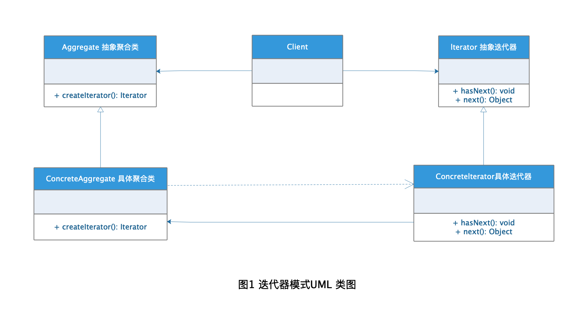
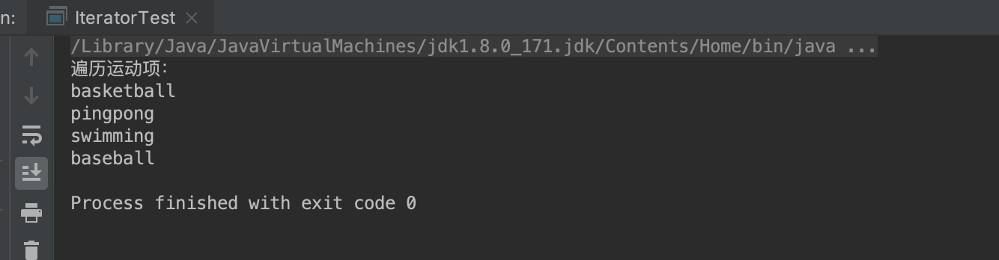

# Iterator Pattern迭代器模式

迭代器这个词熟悉编程语言的一定都不会陌生，许多编程语言的集合处理都会使用到迭代器，设计模式中正好也有一种设计模式名字就叫做迭代器模式，这种设计模式就是用于顺序访问集合对象的元素，而不需要知道集合对象的底层表示。

## 定义

[迭代器模式](https://baike.baidu.com/item/%E8%BF%AD%E4%BB%A3%E5%99%A8%E6%A8%A1%E5%BC%8F/1355498?fr=aladdin) 在百度上的定义：
> **迭代器模式（Iterator Pattern）:** 提供一种方法顺序访问一个聚合对象中的各种元素，而又不暴露该对象的内部表示。

## 角色分析



从图1的迭代器模式UML 类图可以看出迭代器模式有下面几种角色：

+ **Iterator 抽象迭代器：** 定义访问和遍历聚合对象内容元素的接口。

+ **ConcreteIterator 具体迭代器：** 实现了抽象迭代器的接口声明，提供具体的访问和遍历方法实现。

+ **Aggregate 抽象聚合类：** 定义创建相应迭代器对象的接口，用于生成对应的迭代器。

+ **ConcreteAggregate 具体聚合类：** 具体某类元素的聚合对象，继承了抽象聚合类，实现了对应的迭代器创建接口声明。

## 示例

Java 中的集合类都使用了迭代器模式，下面以自定义集合来演示迭代器模式的使用：

###Iterator 抽象迭代器

```java
public interface MyIterator {

    /**
     * 是否有下一个
     * @return
     */
    boolean hasNext();

    /**
     * 获取下一个
     * @return
     */
    Object next();
}
```

### ConcreteIterator 具体迭代器

```java
public class SportIterator implements MyIterator {

    /**
     * 运动集合
     */
    private SportsContainer sports;

    /**
     * 查询下标
     */
    private int index;

    /**
     * 构造函数传入运动集合
     * @param sports
     */
    public SportIterator(SportsContainer sports) {
        this.sports = sports;
    }

    @Override
    public boolean hasNext() {
        if(index < sports.size()){
            return true;
        }
        return false;
    }

    @Override
    public Object next() {
        if(this.hasNext()){
            return sports.getSport(index++);
        }
        return null;
    }
}
```

### Aggregate 抽象聚合类

```java
public interface Container {

    /**
     * 获取迭代器方法
     * @return
     */
    MyIterator createIterator();
}
```

### ConcreteAggregate 具体聚合类

```java
public class SportsContainer implements Container {

    /**
     * 运动集合
     */
    private List<String> sports = new ArrayList<>();

    /**
     * 添加运动项
     * @param sport 运动项
     */
    public void addSport(String sport) {
        sports.add(sport);
    }

    /**
     * 删除运动项
     * @param sport 运动项
     */
    public void removeSport(String sport) {
        sports.remove(sport);
    }

    /**
     * 获取指定下标的运动
     * @param index 下标
     * @return 运动项
     */
    public Object getSport(int index) {
        return sports.get(index);
    }

    /**
     * 运动数量
     * @return 运动数量
     */
    public int size() {
        return sports.size();
    }

    @Override
    public MyIterator createIterator() {
        return new SportIterator(this);
    }
}
```

### 测试

```java
public class IteratorTest {

    public static void main(String[] args) {
        SportsContainer container = new SportsContainer();

        container.addSport("basketball");
        container.addSport("pingpong");
        container.addSport("swimming");
        container.addSport("baseball");

        MyIterator iterator = container.createIterator();
        System.out.println("遍历运动项：");
        while (iterator.hasNext()) {
            System.out.println(iterator.next().toString());
        }
    }
}
```

### 结果



## 应用场景

+ 访问一个聚合对象的内容而无需暴露它的内部表示

+ 聚合对象需要多正遍历访问方式。

+ 为遍历不同的聚合结构提供一个统一的接口

## 优点

+ 支持以不同方式对聚合对象进行访问遍历。

+ 实现了对统一聚合类的不同遍历处理。

+ 聚合类和迭代器直接解耦，可以方便的进行扩展。

+ 迭代器的声明简化了聚合类的接口。

## 缺点

由于迭代器模式将存储数据和遍历数据的职责分离，增加新的聚合类需要对应增加新的迭代器类，类的个数成对增加，这在一定程度上增加了系统的复杂性。