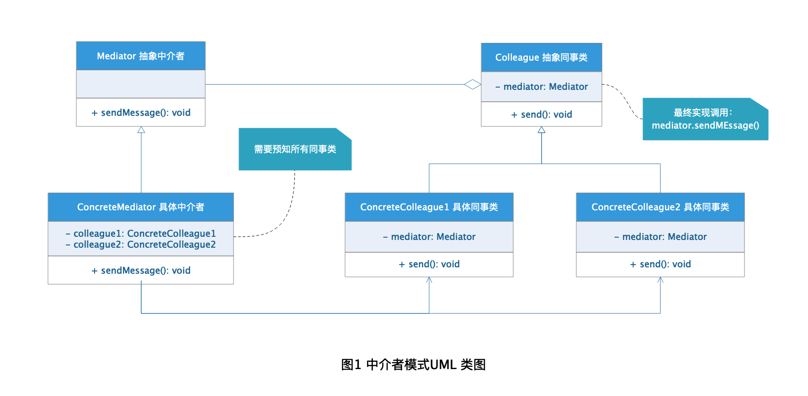

# Mediator Pattern 中介者模式

我们一般需要租房买房的时候首先想到的一定是房屋中介，为什么呢？因为房屋中介掌握了更多的房屋房主信息，还可以帮我们和房主进行沟通协调，这是我们租房买房变的更加简单，我们只需要和房屋中介打交道就可以完成我们的需求，而不需要一个一个地和房主沟通比较才能选择到合适的房子。在软件设计也有类似房屋中介这种角色应用的设计模式--那就是中介者模式！

## 定义

**中介者模式：** 用一个中介对象来封装一系列的对象交互，中介者使各个对象不需要显示的相互应用，从而使其耦合松散，而且可以独立地改变它们之间的交互。

## 角色分析



从图1 的中介者模式UML 类图中可以看出中介者模式包含下面几种角色：

+ **Mediator 抽象中介者：** 定义了中介者与同事类之间的识别方法。

+ **ConcreteMediator 具体中介者：** 具体中介类，实现了抽象中介者的接口定义，同时内部依赖于所有具体同事类。

+ **Colleague 抽象同事类：** 需要与中介者进行通信交互的抽象类，定义了中介者通信后的行为。

+ **ConcreteColleague 具体同事类：** 具体同事类，与其他同事类之间没有依赖关系，只关注与中介者的通信交互。

## 示例

下面还是以租房为栗子演示下中介模式的使用：

### Mediator 抽象中介者

```java
public interface HouseMediator {

    /**
     * 传递消息
     * @param message 消息
     * @param people 房屋用户
     */
    void sendMessage(String message, People people);
}
```

### ConcreteMediator 具体中介者

```java
public class Lianjia implements HouseMediator {

    /**
     * 房主
     */
    private HouseOwner owner;

    /**
     * 租户
     */
    private Tenant tenant;

    private final String CHEAP_HOUSE = "单身公寓";

    private final String EXPENSIVE_HOUSE = "洋房";


    public void setOwner(HouseOwner owner) {
        this.owner = owner;
    }

    public void setTenant(Tenant tenant) {
        this.tenant = tenant;
    }

    @Override
    public void sendMessage(String message, People people) {
        if (people == owner) {
            System.out.println("房主发布消息");
            people.action(message);
            if (message.contains(EXPENSIVE_HOUSE)) {
                tenant.action("我没钱，租不起洋房！");
            } else if (message.contains(CHEAP_HOUSE)) {
                tenant.action("这单身公寓不错，可以先去看看吗？");
            }
        } else if (people == tenant) {
            System.out.println("租户提供需求");
            people.action(message);
            if (message.contains(EXPENSIVE_HOUSE)) {
                owner.action("欢迎来我的房子查看，环境舒适，家具齐全，绝对适合您！");
            } else if (message.contains(CHEAP_HOUSE)) {
                owner.action("没钱还想租啥好房子啊，自己去看看地下室吧！");
            }
        }
    }
}
```

### Colleague 抽象同事类

```java
public abstract class People {

    /**
     * 中介
     */
    private HouseMediator mediator;

    /**
     * 姓名
     */
    private String name;

    /**
     * 构造函数
     * @param mediator 中介
     * @param name 姓名
     */
    public People(HouseMediator mediator, String name) {
        this.mediator = mediator;
        this.name = name;
    }

    public People() {
    }

    public HouseMediator getMediator() {
        return mediator;
    }

    public void setMediator(HouseMediator mediator) {
        this.mediator = mediator;
    }

    public String getName() {
        return name;
    }

    public void setName(String name) {
        this.name = name;
    }

    /**
     * 发送消息
     */
    public void send(String message) {
        mediator.sendMessage(message, this);
    }

    /**
     * 接收消息后的行为
     */
    public abstract void action(String message);
}
```

### ConcreteColleague 具体同事类

```java
public class HouseOwner extends People {

    public HouseOwner(HouseMediator mediator, String name) {
        super(mediator, name);
    }

    @Override
    public void action(String message) {
        System.out.println("我是房主--" + this.getName() + "：" + message);
    }
}

public class Tenant extends People {

    public Tenant(HouseMediator mediator, String name) {
        super(mediator, name);
    }

    @Override
    public void action(String message) {
        System.out.println("我是租户--" + this.getName() + "：" + message);
    }
}

```

### 测试

```java
public class MediatorTest {

    public static void main(String[] args) {
        Lianjia lianjia = new Lianjia();

        HouseOwner owner = new HouseOwner(lianjia, "张三");
        Tenant tenant = new Tenant(lianjia, "小明");

        lianjia.setOwner(owner);
        lianjia.setTenant(tenant);

        owner.send("我有一套海景洋房出租！");
        tenant.send("我想租一套便宜的单身公寓！");
    }
}
```

### 结果


## 应用场景

+ 系统中存在多个复杂对象，并且它们之间相互依赖，交互复杂难以理清。

+ 想通过中间类来封装多个类的行为但是又不想生成太多子类的场景。

+ 想简化一组对象以定义良好但是复杂的通信交互的场景。

## 优点

+ 减少了类与类之间的耦合。

+ 降低了类的复杂度，将一对多关系转为一对一。

+ 增加了系统灵活性，利于扩展。

## 缺点

+ 中介者需要事先知道所有同事类的交互细节，使得中介类变得复杂难以维护。

+ 中介者对同事类是透明的，导致增加同事类的时候需要修改中介者的逻辑代码，不符合开闭原则。

