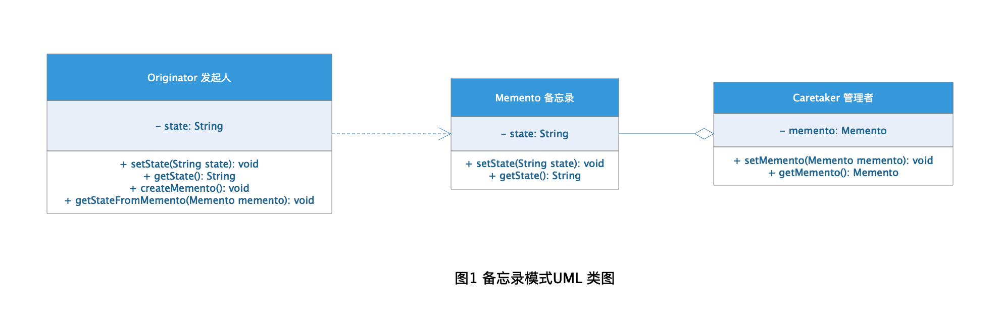
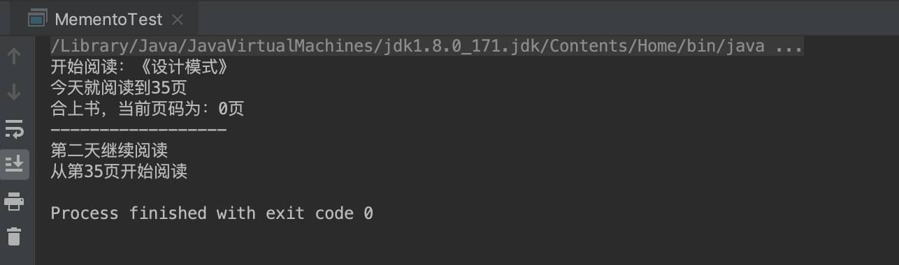

# Memento Pattern 备忘录模式

备忘录现实生活中其实用的很多，我们为了记住某些重要的事情防止自己遗忘，经常会选择将这个事情记录在备忘录中，当有需要的时候可以很方便的查看。在做软件系统开发过程中，我们也会有类似的需求，需要我们把类的属性记录下来，当有需要的时候可以根据记录对这个类的属性进行恢复，这就是软件设计中备忘录的应用，也就是常说的备忘录模式。

## 定义

备忘录模式（Memento Pattern）又叫做快照模式（Snapshot Pattern）或Token模式，是GoF的23种设计模式之一，属于行为模式。

> **备忘录模式：** 在不破坏封闭的前提下，捕获一个对象的内部状态，并在该对象之外保存这个状态。这样以后就可将该对象恢复到原先保存的状态。

## 角色分析



从图1的备忘录UML 类图可以看出备忘录有下面几种角色：

+ **Originator 发起人：** 含有备忘录的引用，用于创建备忘录，可以记录当时的内部状态，根据需要对内部状态进行恢复。

+ **Memento 备忘录：** 负责记录发起人的内部状态，并防止发起人以外的对象访问备忘录。

+ **Caretaker 管理者：** 负责对备忘录进行保存，同时无法对备忘录的内容进行访问操作。

**注意：** 备忘录有两个接口：

+ 宽接口--允许访问返回到先前状态所需要的所有数据：Originator使用。

+ 窄接口--只能将备忘录传递给其他对象而无法对内容进行访问操作：Caretaker使用。

## 示例

下面以读书为栗子演示备忘录模式的应用：

### Originator 发起人

```java
public class Book {

    //书名
    private String name;

    //当前页码
    private int currentPage;

    public int getCurrentPage() {
        return currentPage;
    }

    public void setCurrentPage(int currentPage) {
        this.currentPage = currentPage;
    }

    public String getName() {
        return name;
    }

    public void setName(String name) {
        this.name = name;
    }


    //插入书签
    public Bookmark createBookmark() {
        return new Bookmark(currentPage);
    }

    //取出书签阅读
    public void readFromBookmark(Bookmark bookmark) {
        this.currentPage = bookmark.getCurrentPage();
    }
}
```

### Memento 备忘录

```java
public class Bookmark {

    //当前页码
    private int currentPage;

    public Bookmark(int currentPage) {
        this.currentPage = currentPage;
    }

    //读取当前页码
    public int getCurrentPage() {
        return currentPage;
    }

    //保存当前页码
    public void setCurrentPage(int currentPage) {
        this.currentPage = currentPage;
    }
}
```

### Caretaker 管理者

```java
public class BookmarkCaretaker {

    //书签
    private Bookmark bookmark;

    //设置书签
    public void setBookmark(Bookmark bookmark) {
        this.bookmark = bookmark;
    }

    //读取书签
    public Bookmark getBookmark() {
        return this.bookmark;
    }
}
```

### 测试

```java
public class MementoTest {

    public static void main(String[] args) {

        Book book = new Book();
        book.setName("《设计模式》");
        System.out.println("开始阅读：" + book.getName());
        book.setCurrentPage(35);

        BookmarkCaretaker bookmarkCaretaker = new BookmarkCaretaker();
        System.out.println("今天就阅读到" + book.getCurrentPage() + "页");
        bookmarkCaretaker.setBookmark(book.createBookmark());
        System.out.print("合上书，");
        book.setCurrentPage(0);
        System.out.println("当前页码为：" + book.getCurrentPage() + "页");
        System.out.println("------------------");

        System.out.println("第二天继续阅读");
        book.readFromBookmark(bookmarkCaretaker.getBookmark());
        System.out.println("从第" + book.getCurrentPage() + "页开始阅读");
    }
}
```

### 结果



## 应用场景

+ 适用于功能比较复杂但是需要记录或维护属性历史的类，或者对类的部分属性需要进行保存恢复的场景。

+ 系统需要提供撤销恢复的功能的场景。

## 优点

+ 提供了某种快照的方式方便用户可以快速的恢复到需要的历史状态。

+ 对内部信息进行封装，使得用户在进行保存状态时无需关注细节。


## 缺点

+ 如果发起人需要保存的内部细节越完整需要消耗的系统资源也越多。

+ 当发起人将一个备忘录存储起来的时候，发起人可能并不知道这个状态会占用多大的存储空间，从而无法提醒用户这个操作是否昂贵。