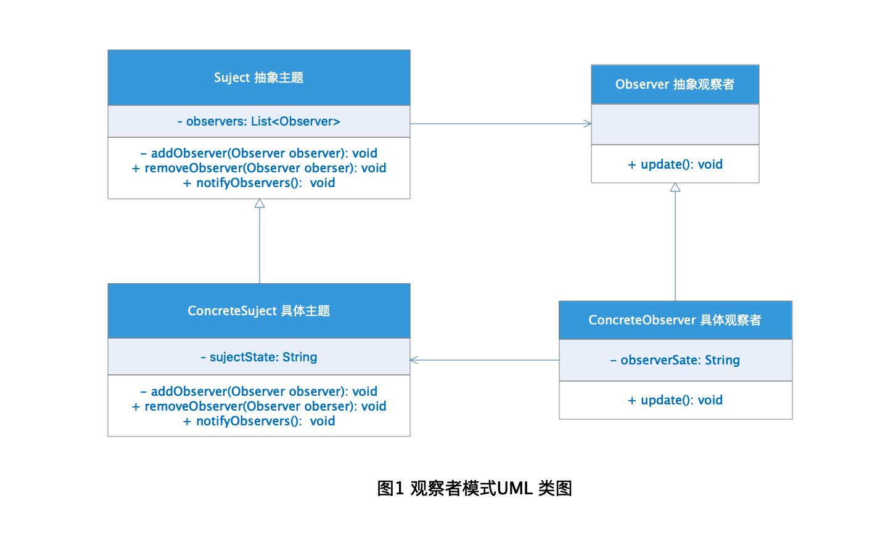
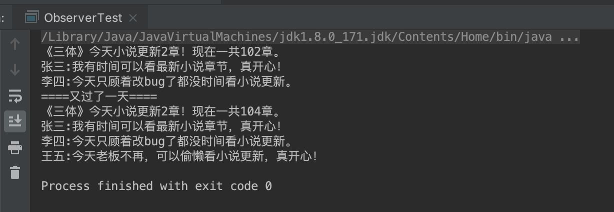

# Observer Pattern 观察者模式

现在流行网络直播，看网络直播经常会听到这么一句话"关注主播不迷路"，什么意思呢？就是对自己喜欢的网络博主进行关注后，网络博主有什么最新的动态都会自动的通知到关注他的粉丝，粉丝就可以根据通知选择自己想要了解的讯息进行了解，这种关注通知的方式，在软件设计中也经常使用到，被叫做发布订阅模式，也就是观察者模式。

## 定义

**观察者模式：** 观察者模式又叫发布订阅模式，定义了一种一对多的依赖关系，让多个观察者对象同时对某一个主题对象进行监听，这个主题对象在状态发生变化对时候会同时所有观察者对象，使它们能够自动更新自己。

## 角色分析



从图1的观察者模式UML 类图中可以看出观察者模式有下面几种角色：

+ **Subject 抽象主题：** 含有对该主题进行关注的观察者集合引用，可以对观察者对象进行新增和删除，还有就是对观察者对象进行消息通知，简单来说就是对观察者的操作进行定义。

+ **ConcreteSubject 具体主题：** 具体某个主题，实现了抽象出题的接口定义，当主题内部状态发生改变时会通知观察者对象进行更新。

+ **Observer 抽象观察者：** 为所有的具体观察者定义一个统一的更新接口，用于主题发送消息时进行自我更新使用。

+ **ConcreteObserver 具体观察者：** 具体观察者是对具体主题的观察对象类型，实现了抽象观察者的更新接口定义，通常含有具体主题的引用用户获取具体主题的状态改变。

## 示例

下面以订阅小说为栗子演示观察者模式的应用：

### Subject 抽象主题

```java
public abstract class Novel {

    private List<Reader> readers = new ArrayList<>();

    public void addReader(Reader reader) {
        readers.add(reader);
    }

    public void removeReader(Reader reader) {
        readers.remove(reader);
    }

    public void notifyReaders() {
        for (Reader reader: readers) {
            reader.read();
        }
    }
}
```

### ConcreteSubject 具体主题

```java
public class ScienceFiction extends Novel {

    private String novelName;

    private int chapter;

    public ScienceFiction(String novelName, int chapter) {
        this.novelName = novelName;
        this.chapter = chapter;
    }

    public void updateChapter() {
        this.chapter += 2;
        System.out.println(novelName + "今天小说更新2章！");
    }
}
```

### Observer 抽象观察者

```java
public interface Reader {

    /**
     * 阅读小说
     */
    void read();
}
```

### ConcreteObserver 具体观察者

```java
public class Student implements Reader {

    private boolean available;

    private String name;

    public Student(String name) {
        this.name = name;
    }

    public void setAvailable(boolean available) {
        this.available = available;
    }

    @Override
    public void read() {
        if (available) {
            System.out.println(name + ":我有时间可以看最新小说章节，真开心！");
        } else {
            System.out.println(name + ":今天太忙了小说更新了也没时间看。");
        }
    }
}

public class Programmer implements Reader {

    private boolean available;

    private String name;

    public Programmer(String name) {
        this.name = name;
    }

    public void setAvailable(boolean available) {
        this.available = available;
    }

    @Override
    public void read() {
        if (available) {
            System.out.println(name + ":今天老板不再，可以偷懒看小说更新，真开心！");
        } else {
            System.out.println(name + ":今天只顾着改bug了都没时间看小说更新。");
        }
    }
}
```

### 测试

```java
public class ObserverTest {

    public static void main(String[] args) {
        ScienceFiction santi = new ScienceFiction("《三体》", 100);

        Student zhang = new Student("张三");
        zhang.setAvailable(true);
        santi.addReader(zhang);
        Programmer li = new Programmer("李四");
        li.setAvailable(false);
        santi.addReader(li);

        santi.updateChapter();
        santi.notifyReaders();

        System.out.println("====又过了一天====");
        Programmer wang = new Programmer("王五");
        wang.setAvailable(true);
        santi.addReader(wang);
        santi.updateChapter();
        santi.notifyReaders();
    }
}
```

### 结果



## 应用场景

+ 当一个对象的改变需要影响其他对象进行改变，并且不知道具体对象个数的时候考虑使用观察者模式。

+ 一个抽象模型依赖两个方面，为了减少它们之间的依赖，可以使用观察者模式进行解耦，将两个方面封装成单独的对象这样可以方便改变和复用。

+ 一个对象必须通知其他对象，但是并不知道其他对象是谁的场景。

+ 系统需要一种触发机制将对象行为进行传递，从而对需要影响的对象产生连锁影响。

## 优点

+ 可以建立触发机制。

+ 将主题与观察者之间的直接依赖变为依赖抽象，这样可以降低类与类之间的耦合。

+ 支持广播通信。

## 缺点

+ 客户端必须知道所有观察者，并且对观察者进行操作。

+ 如果主题的观察者过多，需要通知所有观察者的时候会话费很长的时间。

+ 观察者模式没有相应的机制让观察者知道所观察的目标对象是怎么发生变化的，而仅仅只是知道观察目标发生了变化。

+ 如果在观察者和观察目标之间有循环依赖的话，观察目标会触发它们之间进行循环调用，可能导致系统崩溃。