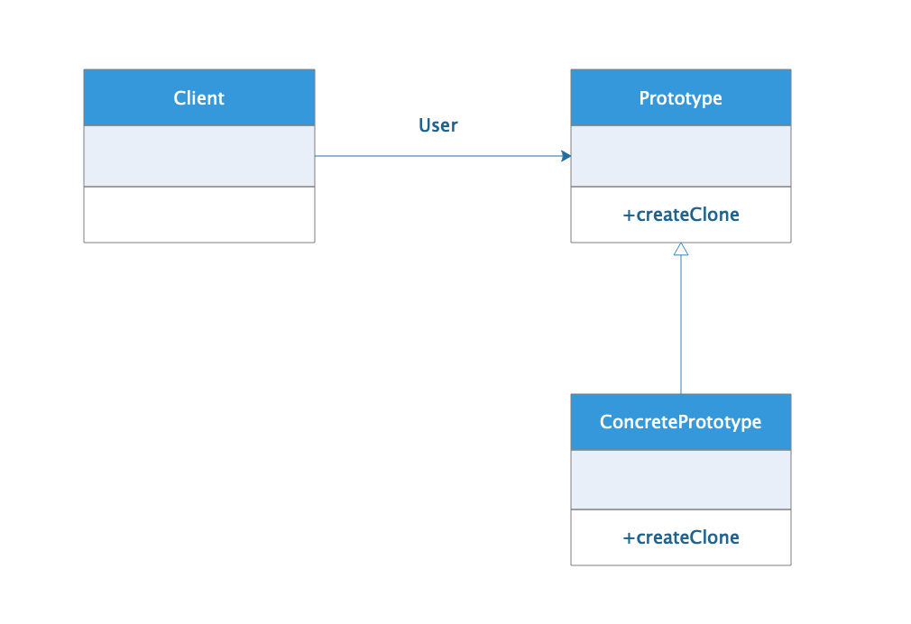

# Prototype 原型模式

原型模式就是通过一个类的对象实例复制出多个相同类的对象实例，既然要涉及到复制那么肯定会应用到clone()方法，原型模式也是
对对象创建的模式，为什么要通过原型模式的clone() 来创建对象呢，这是因为通过new 关键字创建对象时JVM 的效率不高，当出现
频繁创建对象的场景new 这种方式就会出现它的劣势，而通过clone() 方法创建对象速度会比单纯的new 对象快，这也是为什么会总结出
原型模式的原因，当然随着JVM 的不对优化，现在通过new 创建对象的效率已经和通过clone() 创建的速度相当了。

## 应用场景

1. 需要频繁创建对象，并且对象类型众多，无法整合。
2. 无法知道具体的类类型，无法通过new 关键字创建。
3. 希望对类型创建过程解耦，使创建对象实例不依赖于具体的类型。

## 缺点

1. 违背类"开闭原则"，如果需要对类进行扩展时，必须修改基类。
2. 类必须实现clone() 方法，当对象涉及到深拷贝时可能拷贝逻辑相对复杂。

## 模式分析

原型模式的关键就在于clone() , 所以原型模式的类必须实现`java.lang.Cloneable` 接口，因为Java 中所有的类都是Object 类的
子类，而而Object类提供一个clone()方法，可以将一个Java对象复制一份。因此在Java中可以直接使用Object提供的clone() 方法来实现对象的克隆，
Java语言中的原型模式实现很简单。如果没有实现`java.lang.Cloneable` 接口，直接调用clone() 方法，编译器会抛出一个CloneNotSupportedException异常，无法通过编译。
说到对象的克隆复制,就肯定少不了**深拷贝**和**浅拷贝**的区别，有兴趣的同学可以自行查阅资料了解一下。

**注意：`java.lang.Cloneable` 接口并没有定义任何方法，这个接口只是用来标识表示这个Java类支持复制**

## 角色分析



通过上面的类图，我们可以知道原型模式涉及到下面3种角色：

### Prototype 抽象原型

抽象原型就是用于定义复制生成新实例方法的抽象类。

### ConcretePrototype 具体原型

具体原型是抽象原型的具体实现，实现抽象原型定义的方法返回具体的类型的对象实例。

## Client 客户端

客户端就是使用原型模式来进行类实例创建的类。

## 示例

### Car 类 -- 抽象原型类

```java
public abstract class Car implements Cloneable {

    /**
     * 打印汽车行驶速度
     */
    public abstract void carSpeed();

    /**
     * 定义了生成Car 实例的抽象方法
     * @return
     */
    public abstract Car createClone();

}
```

### Bus / Van 类 -- 具体原型类

```java
public class Bus extends Car {

    @Override
    public void carSpeed() {
        System.out.println("Bus 时速最多70公里每小时");
    }

    /**
     * 调用clone() 方法返回实例
     * @return
     */
    @Override
    public Car createClone() {
        Car car = null;
        try {
            car = (Car) clone();
        } catch (CloneNotSupportedException e) {
            e.printStackTrace();
        }
        return car;
    }
}

public class Van extends Car{

    @Override
    public void carSpeed() {
        System.out.println("Van 时速最多140公里每小时");
    }

    /**
     * 调用clone() 方法返回实例
     * @return
     */
    @Override
    public Car createClone() {
        Car car = null;
        try {
            car = (Car) clone();
        } catch (CloneNotSupportedException e) {
            e.printStackTrace();
        }
        return car;
    }
}

```

### CarProducer 类 -- 客户端

```java
public class CarProducer {

    //保存对应类型之间的实例映射
    private HashMap<String, Car> carHashMap = new HashMap<String, Car>();

    //通过别名保存类型实例
    public void keepCar(String carName ,Car car){
        carHashMap.put(carName, car);
    }

    /**
     * 调用抽象实例方法生成实例
     * @param carName
     * @return
     */
    public Car createCar(String carName){
        Car car = carHashMap.get(carName);
        return car.createClone();
    }
}
```

### Main 类 -- 测试类

```java
public class Main {

    public static void main(String[] args) {

        CarProducer producer = new CarProducer();

        Van van = new Van();

        Bus bus = new Bus();

        producer.keepCar("van", van);

        producer.keepCar("bus", bus);

        Car car = producer.createCar("van");
        car.carSpeed();

        Car car1 = producer.createCar("bus");
        car1.carSpeed();
    }
}
```

### 结果

