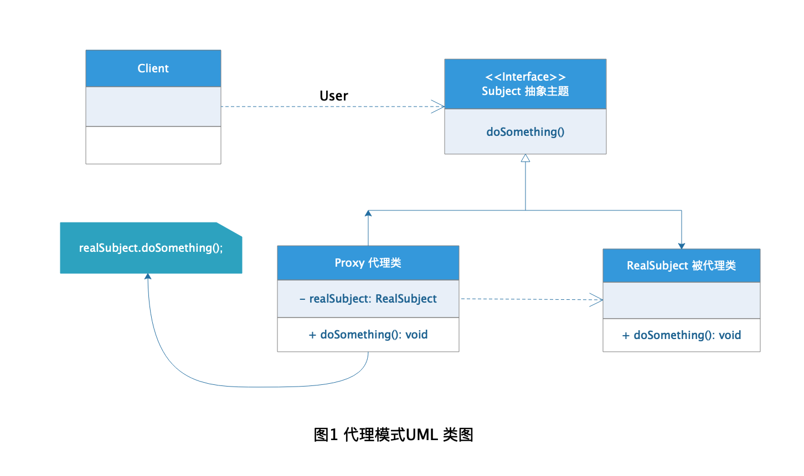
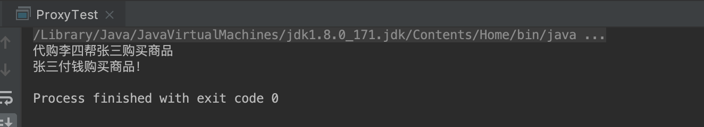

# Proxy 代理模式

代理这个词在现在这个网购社会肯定不会陌生，那什么是代理呢？我们平时听到的很多的代购其实就是一种代理，客户需要购买某类商品但是不要亲自去购买而是让代购帮忙购买，最后同样能买到想要的商品。
开发中使用的代理模式也是借用的代理的概念的一种设计模式，客户端不要要接触实际需要的类的使用，或者屏蔽客户端对实际业务类的使用，而通过代理类对象完成所需要的业务操作。

## 定义

[代理模式](https://zh.wikipedia.org/wiki/%E4%BB%A3%E7%90%86%E6%A8%A1%E5%BC%8F) 在维基百科上的定义是这样的：

**代理模式（英语：Proxy Pattern）** 是程序设计中的一种设计模式。所谓的代理者是指一个类别可以作为其它东西的接口。代理者可以作任何东西的接口：网络连接、存储器中的大对象、文件或其它昂贵或无法复制的资源。

## 角色分析



从图1的代理模式UML 类图中可以看出，代理模式主要有下面几种角色：

+ **抽象主题：** 定义代理类和被代理类公共的对外方法，公共方法的定义使得代理类可以完成被代理类的工作。

+ **代理类：** 代理模式的核心类，主要是用于供客户端使用，对代理类进行隔离。

+ **被代理类：** 客户端最终需要的实际完成的业务需求类。

## 示例

下面我还是以代购这个过程为栗子演示代理模式的使用。

### 抽象主题

```java
public interface Action {

    /**
     * 购买商品方法
     */
    void buy();
}
```

### 被代理类

```java
public class NormalUser implements Action {

    /**
     * 用户名
     */
    public String userName;

    /**
     * 构造函数
     * @param userName 用户名
     */
    public NormalUser(String userName) {
        this.userName = userName;
    }

    /***
     * 用户购买方法
     */
    @Override
    public void buy() {
        System.out.println(userName +"付钱购买商品！");
    }
}
```

### 代理类

```java
public class ProxyUser implements Action {

    /**
     * 代购名称
     */
    public String proxyName;

    /**
     * 含有别代理对象的引用
     */
    private NormalUser user;

    /**
     * 构造函数传入需要代理的对象
     * @param proxyName 代购名称
     * @param user 被代理对象
     */
    public ProxyUser(String proxyName, NormalUser user) {
        this.proxyName = proxyName;
        this.user = user;
    }

    /**
     * 代购购买方法
     */
    @Override
    public void buy() {
        System.out.println("代购" + proxyName + "帮" + user.userName + "购买商品");
        user.buy();
    }
}
```

### 客户端

```java
public class ProxyTest {

    /**
     * main函数模拟整个代购过程
     */
    public static void main(String[] args) {
        NormalUser normalUser = new NormalUser("张三");
        ProxyUser proxyUser = new ProxyUser("李四", normalUser);

        proxyUser.buy();
    }
}
```

### 结果




