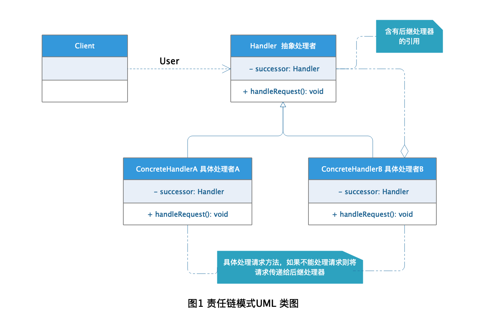

# Chain of Responsibility Pattern 责任链模式

现实中处理某些具体问题的时候并不是一定能够处理，这时候肯定会将问题抛给可以处理的人去处理。开发中也有这样的应用，将请求不停传递直到有对象能够处理请求为止，这就是责任链模式。责任链模式的应用很多，比如web开发中常用到的Filter 就使用到链责任链模式。

## 定义

[责任链模式](https://zh.wikipedia.org/wiki/%E8%B4%A3%E4%BB%BB%E9%93%BE%E6%A8%A1%E5%BC%8F) 在维基百科上的定义是这样的：

> **责任链模式** 在面向对象程式设计里是一种软件设计模式，它包含了一些命令对象和一系列的处理对象。每一个处理对象决定它能处理哪些命令对象，它也知道如何将它不能处理的命令对象传递给该链中的下一个处理对象。该模式还描述了往该处理链的末尾添加新的处理对象的方法。

简单的来说，**责任链模式：** 使多个对象多有机会处理请求，从而避免请求发送者和接受者之间的耦合关系，将处理对象连成一个链路，依次传递请求知道有对象可以处理请求为止。

## 角色分析



从图1的责任链UML 类图中可以分析出，责任链模式主要有下面几种角色：

+ **Handler 抽象处理者：** 抽象处理请求的定义，含有后继处理器的引用用以传递请求。

+ **ConcreteHandler 具体处理者：** 处理具体某个请求，如果无法处理则向下继续传递请求。

## 示例

下面以公司请假为栗子演示责任链的应用：

### Handler 抽象处理者

```java
public abstract class Manager {

    /**
     * 上级领导
     */
    private Manager superior;

    /**
     * 设置下级处理者
     * @return
     */
    public Manager getSuperior() {
        return superior;
    }

    /**
     * 获取下级处理者
     * @param superior
     */
    public void setSuperior(Manager superior) {
        this.superior = superior;
    }

    /**
     * 处理请假方法
     * @param days 请假天数
     */
    public abstract void handleLeaveRequest(int days);
}
```

### ConcreteHandler 具体处理者

```java
public class ProjectManager extends Manager{

    @Override
    public void handleLeaveRequest(int days) {
        //小于一天的请假
        if (days > 0 && days <= 1) {
            System.out.println("项目经理直接处理");
        } else {
            System.out.println("项目经理向上级申请==");
            //大于1天的请假
            if (null != getSuperior()) {
                //交给上级领导处理
                getSuperior().handleLeaveRequest(days);
            }
        }
    }
}

public class TechManager extends Manager {

    @Override
    public void handleLeaveRequest(int days) {
        //3天以内的请假技术总监有权处理
        if (days > 0 && days <= 3) {
            System.out.println("技术总监处理请假");
        } else {
            System.out.println("技术总监向上级申请==");
            //大于3天的请假
            if (null != getSuperior()) {
                //上级领导处理
                getSuperior().handleLeaveRequest(days);
            }
        }
    }
}

public class CEO extends Manager {

    @Override
    public void handleLeaveRequest(int days) {
        //总经理直接处理请假请求
        System.out.println("总经理权利最大，直接处理请假请求");
    }
}

```

### 测试

```java
public class ChainTest {

    public static void main(String[] args) {
        Manager projectManager = new ProjectManager();
        Manager techManager = new TechManager();
        Manager ceo = new CEO();
        projectManager.setSuperior(techManager);
        techManager.setSuperior(ceo);

        System.out.println("张三向项目经理请半天假：");
        projectManager.handleLeaveRequest(0.5F);
        System.out.println();

        System.out.println("李四向项目经理请2天假：");
        projectManager.handleLeaveRequest(2);
        System.out.println();

        System.out.println("王五向项目经理请5天假");
        projectManager.handleLeaveRequest(5);
        System.out.println();

        System.out.println("小六子和项目经理关系不好，直接找总经理请2天假：");
        ceo.handleLeaveRequest(2);

    }
}
```

### 结果


## 应用场景

+ 对象请求的处理对象需要在运行时动态获知的应用场景。

+ 不关注具体请求处理者只关注请求处理结果的应用场景。

+ 需要延时处理请求的应用场景。

## 优点

+ 将请求发送者和处理者分离，降低耦合。

+ 简化对象，使对象不用关心处理过程而只关注自身处理的请求。

+ 增加了代码灵活性，方便扩展动态增加修改处理对象。

## 缺点

+ 由于处理过程对请求调用者是不透明的黑箱操作，所以无法保证请求一定会被处理。

+ 处理链之间的不透明可能造成处理过程之间的循环调用，避免这种问题需要在使用时明确处理的条件界限。

+ 处理链之间的依次调用对于处理过程复杂的情况调试会显的不那么简单。
