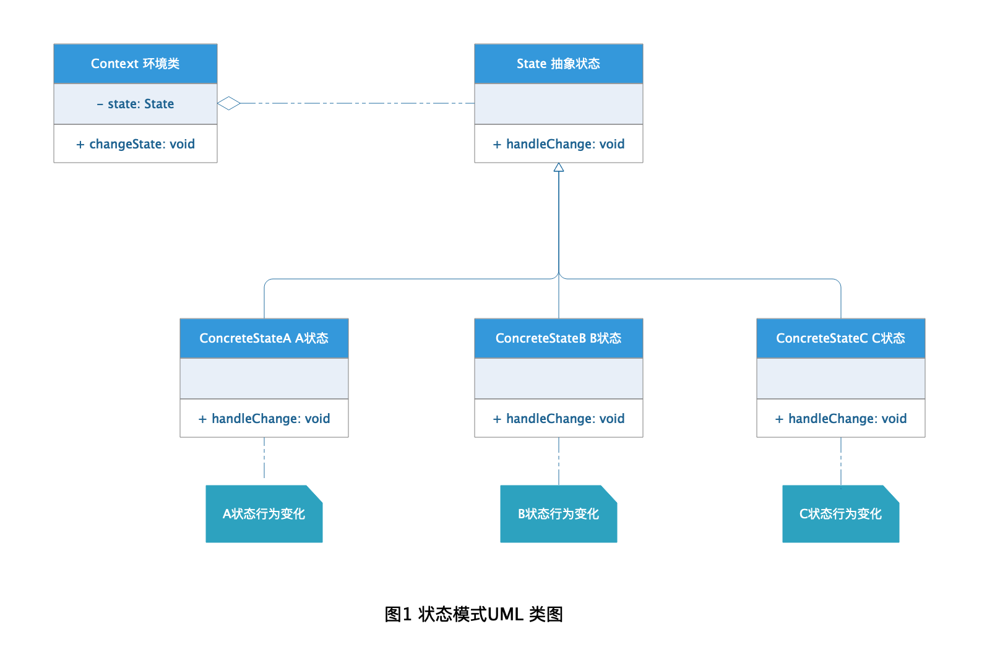
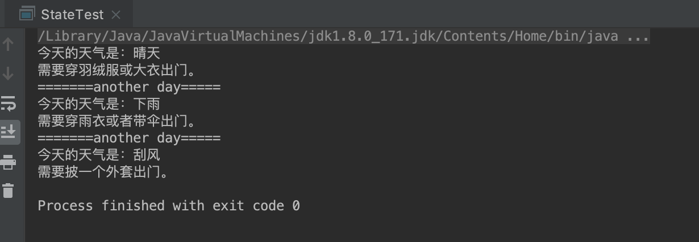

# State Pattern 状态模式

当开发过程中某个类需要根据自身属性变化发生某种行为变化时，最简单的方法就是在方法内部通过条件判断完成，虽然这样能够解决问题，但是存在隐患，当需要变化的属性条件不断增多时，需要修改之间的判断逻辑加入新的判断，这样违背了"开闭原则"，而且不停的增加新逻辑就是在给类增加新的职责，这样也违背了"单一职责原则"，有没有办法解决这个问题呢？设计模式中的状态就是解决这个问题的！

## 定义

**状态模式：** 当一个对象的内部状态改变时允许改变其行为，这个对象看起来像是改变了类。

## 角色分析



从图1的状态模式 UML 类图中可以看出状态模式包含下面几种角色：

+ **State 抽象状态类：** 抽象定义了更Context 环境类相关的状态变化行为接口。

+ **ConcreteState 具体状态类：** 实现了抽象状态类的接口定义，对某种具体状态变化发生具体行为。

+ **Context 环境类：** 需要根据某种状态发生变化的类。

## 示例

下面以不同天气的穿着为栗子演示状态模式的应用：

### State 抽象状态类

```java
public abstract class WeatherDress {

    private String weatherName;

    public String getWeatherName() {
        return weatherName;
    }

    public void setWeatherName(String weatherName) {
        this.weatherName = weatherName;
    }

    public WeatherDress(String weatherName) {
        this.weatherName = weatherName;
    }
    
    public abstract void dressWear();
}
```
 
### ConcreteState 具体状态类

```java
public class SunnyDress extends WeatherDress {
    
    public SunnyDress(String weatherName) {
        super(weatherName);
    }

    @Override
    public void dressWear() {
        System.out.println("今天的天气是：" + this.getWeatherName());
        System.out.println("穿短袖T恤出门就好。");
    }
}

public class WindDress extends WeatherDress {

    public WindDress(String weatherName) {
        super(weatherName);
    }

    @Override
    public void dressWear() {
        System.out.println("今天的天气是：" + this.getWeatherName());
        System.out.println("需要披一个外套出门。");
    }
}

public class RainDress extends WeatherDress {

    public RainDress(String weatherName) {
        super(weatherName);
    }

    @Override
    public void dressWear() {
        System.out.println("今天的天气是：" + this.getWeatherName());
        System.out.println("需要穿雨衣或者带伞出门。");
    }
}

public class SnowDress extends WeatherDress {

    public SnowDress(String weatherName) {
        super(weatherName);
    }

    @Override
    public void dressWear() {
        System.out.println("今天的天气是：" + this.getWeatherName());
        System.out.println("需要穿羽绒服或大衣出门。");
    }
}

```

### Context 环境类

```java
public class Person {

    private String name;

    private WeatherDress weatherDress;

    public Person(String name) {
        this.name = name;
    }

    public WeatherDress getWeatherDress() {
        return weatherDress;
    }

    public void setWeatherDress(WeatherDress weatherDress) {
        this.weatherDress = weatherDress;
    }

    public void goOutKnowTheWeather() {
        this.weatherDress.dressWear();
    }
}
```

### 测试

```java
public class StateTest {

    public static void main(String[] args) {
        Person person = new Person("张三");

        person.setWeatherDress(new SnowDress("晴天"));
        person.goOutKnowTheWeather();

        System.out.println("=======another day=====");

        person.setWeatherDress(new RainDress("下雨"));
        person.goOutKnowTheWeather();

        System.out.println("=======another day=====");
        person.setWeatherDress(new WindDress("刮风"));
        person.goOutKnowTheWeather();
    }
}

```

### 结果



## 作用

状态模式主要是为类解决当控制一个类的状态表达式过于复杂的情况，将状态判断的逻辑转移到不同状态的一系列类中，可以把复杂的逻辑简单化，从而增加灵活性与可扩展性。

## 应用场景

+ 一个对象的行为取决于它的状态，并且它必须在运行时刻根据状态改变它的行为。

+ 一个操作中含有庞大的多分支结构，并且这些分支决定于对象的状态。

## 优点

+ 将对象需要改变的状态和改变的行为从对象中抽离出来成为单独的状态类，这样可以减少状态变化的条件判断，同时增加状态变化的灵活性。 

+ 可以让多个环境对象共享一个状态对象，从而减少系统中对象的个数。

+ 符合"开闭原则"和"单一职责原则"，状态改变只需要对具体状态修改即可。

## 缺点

+ 状态模式的使用必然会增加系统类和对象的个数，所以在状态的条件判断很少的情况不建议改为状态模式。

+ 不恰当的使用状态模式会增加系统的复杂性。