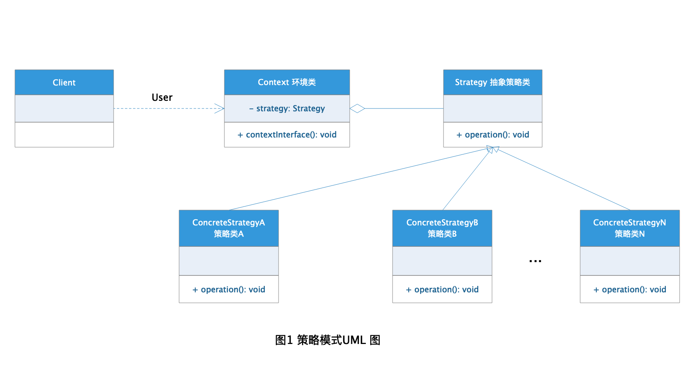

# Strategy 策略模式

在现实生活中我们完成某件事情往往不止一种方案，也就是我们常说的"条条大路通罗马"，而且许多时候我们需要根据不同的环境因素选择不同的解决方案来解决相同的问题，这种解决方案的总结在程序设计中被称为**策略模式**。完成需求的方法有多种每种都是一个策略，具体使用那种策略需要客户端根据具体环境去判断选择。

## 定义

[策略模式](https://zh.wikipedia.org/wiki/%E7%AD%96%E7%95%A5%E6%A8%A1%E5%BC%8F) 在维基百科上的定义是这样的：

> **策略模式** 作为一种软件设计模式，指对象有某个行为，但是在不同的场景中，该行为有不同的实现算法。比如每个人都要“交个人所得税”，但是“在美国交个人所得税”和“在中国交个人所得税”就有不同的算税方法。


策略模式：

+ 定义了一族算法（业务规则）；

+ 封装了每个算法；

+ 这族的算法可互换代替（interchangeable）。


策略模式就是针对完成某种需求封装了一系列的算法，每种算法都是一种策略，客户端根据具体需求选择不同的策略，并且策略之间可以很方便的转换。

## 角色分析



从图1 的策略模式UML 图中我们可以看出策略模式有以下这些角色：

+ Context: 环境类，客户端根据具体的环境选择具体的策略。

+ Strategy: 抽象策略类，完成需求的抽象方法定义，定义了所有策略的算法结构。

+ ConcreteStrategy: 具体策略类，完成需求的具体某种算法，继承或实现了抽象策略类。

## 代码示例

下面我以加载数据库为栗子演示策略模式的应用：

### Context 环境类

```java
public class DBContext {

    /**
     * 加载策略
     */
    private DBStrategy strategy;

    /**
     * 这里用常量某配置
     */
    private final String ORACLE = "oracle";
    private final String SQLSERVER = "sqlserver";
    private final String MYSQL = "mysql";

    /**
     * 获取数据库方法
     */
    public void getDB(String datebaseName) {
        if(null == datebaseName || "".equals(datebaseName)) {
            System.out.println("没有加载数据库");
        } else if (SQLSERVER.equalsIgnoreCase(datebaseName)) {
            strategy = new SqlServerStrategy();
        } else if (ORACLE.equalsIgnoreCase(datebaseName)) {
            strategy = new OracleStrategy();
        } else if (MYSQL.equalsIgnoreCase(datebaseName)) {
            strategy = new MysqlStrategy();
        }
        strategy.loadDB();
    }
}

```

### Strategy 抽象策略类

```java
public interface DBStrategy {

    /**
     * 加载数据库的方法
     */
    void loadDB();
}
```

### ConcreteStrategy 具体策略类

```java
public class MysqlStrategy implements DBStrategy{

    /**
     * mysql 加载数据库方法
     */
    @Override
    public void loadDB() {
        System.out.println("加载mysql 数据库完成");
    }
}

public class SqlServerStrategy implements DBStrategy{

    /**
     * sqlserver 加载数据库方法
     */
    @Override
    public void loadDB() {
        System.out.println("加载sqlserver 数据库完成");
    }
}

public class OracleStrategy implements DBStrategy{

    /**
     * oracle 加载数据库方法
     */
    @Override
    public void loadDB() {
        System.out.println("加载oracle 数据库完成");
    }
}
```

### 测试类

```java
public class DBClient {

    public static void main(String[] args) {

        DBContext context = new DBContext();

        //加载mysql
        context.getDB("mysql");
        System.out.println();

        //加载sqlserver
        context.getDB("sqlserver");
        System.out.println();

        //加载oracle
        context.getDB("oracle");
    }
}
```

### 结果


## 优点

+ 对单个策略进行抽离，根据环境变量进行转换，增加了可扩展性，降低了维护成本。

+ 提供了对"开闭原则"的天然支持，可以灵活的添加新的算法策略。

+ 避免了根据环境变量进行的多重判断，代码可读性更高，显得更可观。

+ 对算法进行统一抽离与管理。

## 缺点

+ 必须知道所有策略，并且根据需求调用需要的策略。

+ 将产生多种策略类，但实际使用的只有单个策略。

## 应用场景

策略模式可以适用于下面这些场景或类似场景：

+ 某一种需求有多种算法可以完成，并且需要根据某种变化进行算法间的转换。

+ 不需要让客户端了解业务底层算法实现，只关注算法结果，将客户端和算法之间进行隔离。

+ 完成单一业务有多个算法，避免系统中的多重判断。