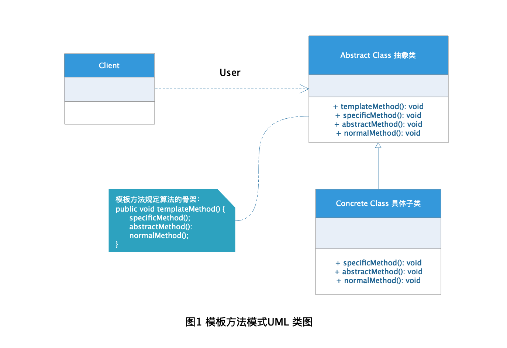
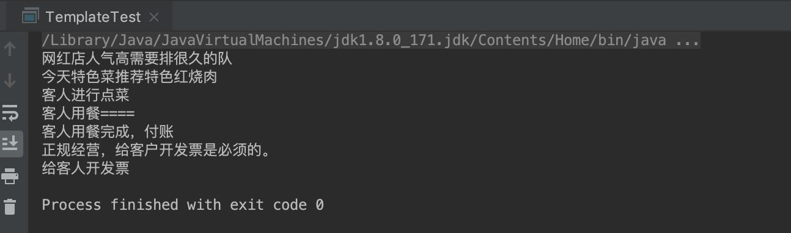

# Template Method Pattern 模板方法模式

在现实生活中我们对模板这个词并不模式，比如我们经常使用到的简介模板，ppt模板，论文模板之类的，什么是模板呢？简单的来说，模板就是为了完成某件事而需要的一个具体示例，完成这件事的大体流程都是类似的，只是具体的实现内容或者实现方式略有不同。例如我们写简历都会先写个人信息，然后是教育经历，最后是工作经验，每个人的简历大体都是这样，但是简历里面的内容却因人而异。在软件开发中，我们将公共算法抽离成模板使用，具体实现细节交给模板的子类来完成，这种设计模式就是模板方法模式。

## 定义

[模板方法模式](https://baike.baidu.com/item/%E6%A8%A1%E6%9D%BF%E6%96%B9%E6%B3%95%E6%A8%A1%E5%BC%8F/8665173?fr=aladdin) 在百度上的定义是这样的：

> **模板方法模式** 定义了一个算法的步骤，并允许子类别为一个或多个步骤提供其实践方式。让子类别在不改变算法架构的情况下，重新定义算法中的某些步骤。

## 角色分析



从图1的模板方法模式UML 类图中可以看出模板方法模式有下面这些角色：

+ **AbstractClass 抽象类：** 给出一个算法的基本骨架，有一个模板方法和多个基本方法构成，模板方法里面规定了实现算法的步骤，而基本方法用来交由子类实现具体算法细节。

+ **ConcreteClass 具体子类：** 实现了父类抽象类的基本方法，完成算法的具体实现。

其中基本方法又暴言下面几类：

+ 抽象方法：在抽象类中只做方法定义，具体实现交给子类完成。

+ 具体方法：在抽象类中已经给出方法实现，子类可以选择继承或者重写方法。

+ 钩子方法：在抽象类中已经给出方法实现，包括用于判断的逻辑方法和需要子类重写的空方法两种。

## 示例

下面以去餐厅吃饭为栗子演示模板方法模式的应用：

### 抽象类

**注意：** 为防止恶意操作，一般模板方法都加上 final 关键词。

```java
public abstract class Restauant {

    /**
     * 排队
     */
    public abstract void waitTime();

    /**
     * 特色菜推荐
     */
    public abstract void specialtyRecommend();

    /**
     * 点餐
     */
    public abstract void order();

    /**
     * 付钱
     */
    public abstract void pay();

    /**
     * 开发票
     */
    public abstract void invoicing();

    /**
     * 是否需要发票
     * @return
     */
    public boolean needInvoice() {
        return true;
    }

    /**
     * 用餐
     */
    public final void consumptionMeal() {
        waitTime();

        specialtyRecommend();

        order();

        System.out.println("客人用餐====");

        pay();

        if (needInvoice()) {
            invoicing();
        }
    }
}
```

### 具体子类

```java
public class WebCelerityShop extends Restauant {

    /**
     * 特色菜
     */
    private String specialty;

    public String getSpecialty() {
        return specialty;
    }

    public void setSpecialty(String specialty) {
        this.specialty = specialty;
    }

    @Override
    public void waitTime() {
        System.out.println("网红店人气高需要排很久的队");
    }

    @Override
    public void specialtyRecommend() {
        System.out.println("今天特色菜推荐" + specialty);
    }

    @Override
    public void order() {
        System.out.println("客人进行点菜");
    }

    @Override
    public void pay() {
        System.out.println("客人用餐完成，付账");
    }

    @Override
    public void invoicing() {
        System.out.println("给客人开发票");
    }

    @Override
    public boolean needInvoice() {
        System.out.println("正规经营，给客户开发票是必须的。");
        return super.needInvoice();
    }

}
```

### 测试

```java
public class TemplateTest {

    public static void main(String[] args) {
        WebCelerityShop webCelerityShop = new WebCelerityShop();
        webCelerityShop.setSpecialty("特色红烧肉");

        webCelerityShop.consumptionMeal();
    }
}
```

### 结果



## 应用场景

当我们要完成某一细节层次一致的过程或者一些类步骤，但其个别步骤在更详细的层次上的实现可能不同时，我们通常考虑使用模板方法模式来处理。

+ 多个子类公有的方法，且基本逻辑一致只是处理细节略有不同的场景。

+ 系统中包含有重要的复杂的方法，可以考虑使用模板方法方式进行拆分改造。

## 优点

+ 将算法的结构封装在父类，而子类实现算法细节，这样可以做到封装不可变而扩展可变。

+ 将算法骨架进行提取，便于代码的复用。

+ 实现算法细节由子类完成，便于子类的扩展，符合开闭原则。

## 缺点

+ 实现算法的子类越多，会导致系统越庞大。

+ 算法实现细节交由子类控制，会导致子类结果影响父类模板方法执行结果，这种反向控制会导致代码可读性变差。

