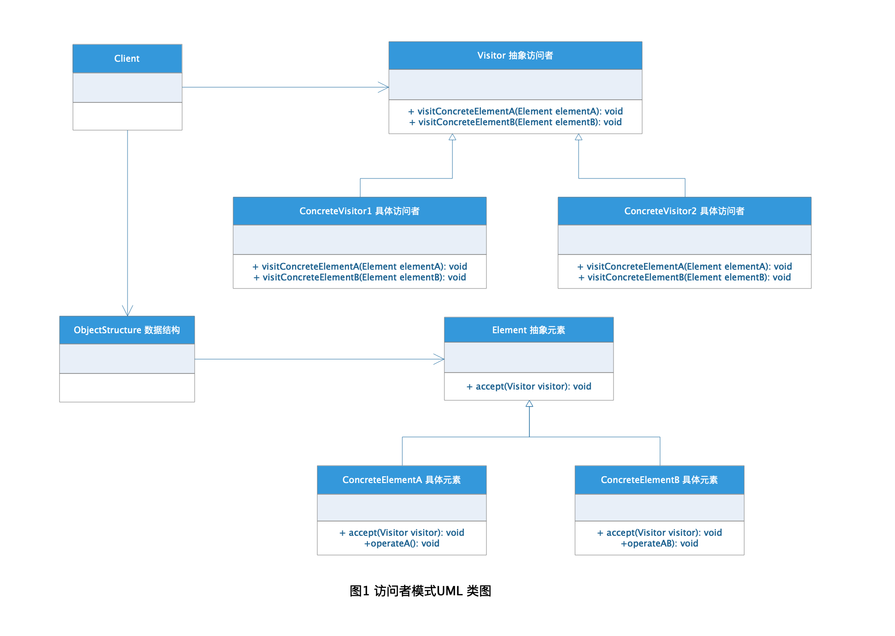
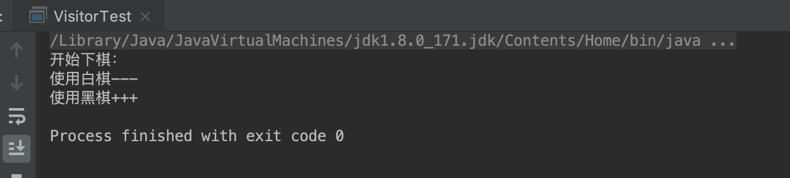

# Visitor Pattern 访问者模式

访问者模式是设计模式中最不好理解的一种，它的核心主要是针对数据结构对象相对稳定的系统将对象的访问操作和数据结构本身进行拆分，这样可以减少系统类之间的耦合，从而增加系统灵活性。

## 定义

在GoF《Design Pattern》上的的定义是这样的：

> **访问者模式：** 表示一个作用于某对象结构中的各元素的操作。它使你可以在不改变各元素类的前提下定义作用于这些元素的新操作。

表示一个作用于某对象结构中的各元素的操作。它使你可以在不改变各元素类的前提下定义作用于这些元素的新操作。

## 角色分析



+ **Visitor 抽象访问者角色：** 为该对象结构中的具体元素提供一个操作访问接口，通过这个访问接口可以实现具体元素对自己的访问操作。

+ **ConcreteVisitor 具体访问者角色：** 具体访问者，实现了抽象访问者定义的接口，对应于数据结构中的具体元素的操作。

+ **Element 抽象元素：** 定义一个接收访问操作的接口，参数为访问者，通过这个接口可以实现对具体元素的操作。

+ **ConcreteElement 具体元素：** 具体元素，实现了抽象元素的接口定义，是数据结构的最终存储对象，也是访问者的访问对象，用来进行元素操作。

+ **ObjectStructure 数据结构：** 能枚举它存储的具体元素，同时提供一个高层接口以允许它的访问者访问它的元素，从而达到对具体元素的操作的目的。

## 示例

### Visitor 抽象访问者角色

下面以下棋为栗子演示访问者模式的使用：

```java
public abstract class GameVisitor {

    /**
     * 访问白棋
     * @param white 白棋
     */
    public abstract void visitWhite(WhiteChess white);

    /**
     * 访问黑棋
     * @param black 黑棋
     */
    public abstract void visitBlack(BlackChess black);
}
```

### ConcreteVisitor 具体访问者角色

```java
public class WhiteVisitor extends GameVisitor {

    @Override
    public void visitWhite(WhiteChess white) {
        white.play();
    }

    @Override
    public void visitBlack(BlackChess black) {

    }
}

public class BlackVisitor extends GameVisitor {

    @Override
    public void visitBlack(BlackChess black) {
        black.play();
    }

    @Override
    public void visitWhite(WhiteChess white) {

    }
}

```

### Element 抽象元素

```java
public abstract class Chess {

    /**
     * 访问接口
     * @param visitor 访问者
     */
    public abstract void accept(GameVisitor visitor);
}
```

### ConcreteElement 具体元素

```java
public class WhiteChess extends Chess {

    @Override
    public void accept(GameVisitor visitor) {
        visitor.visitWhite(this);
    }

    public void play() {
        System.out.println("使用白棋---");
    }
}

public class BlackChess extends Chess {

    @Override
    public void accept(GameVisitor visitor) {
        visitor.visitBlack(this);
    }

    public void play() {
        System.out.println("使用黑棋+++");
    }
}
```

### ObjectStructure 数据结构

```java
public class ChessGame {

    public void whitePlay(GameVisitor visitor) {
       visitor.visitWhite(new WhiteChess());
    }

    public void blackPlay(GameVisitor visitor) {
        visitor.visitBlack(new BlackChess());
    }

}
```

### 测试

```java
public class VisitorTest {

    public static void main(String[] args) {

        ChessGame game = new ChessGame();

        WhiteVisitor whiteChess = new WhiteVisitor();
        BlackVisitor blackChess = new BlackVisitor();

        System.out.println("开始下棋：");
        game.whitePlay(whiteChess);
        game.blackPlay(blackChess);
    }
}
```

### 结果



## 适用场景

访问者模式适用于数据结构相对稳定算法又易变化的系统。因为访问者模式使得算法操作增加变得容易。若系统数据结构对象易于变化，经常有新的数据对象增加进来，则不适合使用访问者模式。

+ 对象结构中对象对应的类很少改变比较固定，但经常需要在此对象结构上定义新的操作。

+ 需要对一个对象结构中的对象进行很多不同的并且不相关的操作，而需要避免让这些操作"污染"这些对象的类，也不希望在增加新操作时修改这些类。

+ 一个对象结构包含很多类对象，它们有不同的接口，而你想对这些对象实施一些依赖于其具体类的操作。

+ 当该对象结构被很多应用共享时，用Visitor模式让每个应用仅包含需要用到的操作。

## 优点

+ 数据结构和数据操作分离，可以使增加新的数据操作变得容易。

+ 访问者的作用只用于实现对元素的访问操作，不包含其他多余的职责，这符合单一职责原则。

+ 增加了系统的灵活性和可扩展性。

## 缺点

+ 访问者模式是针对数据结构相对稳定的系统开发，这就导致增加新的数据结构变得困难。

+ 具体元素对访问者公布细节，违反了迪米特原则。

+ 违反了依赖倒置原则，依赖了具体类，没有依赖抽象。